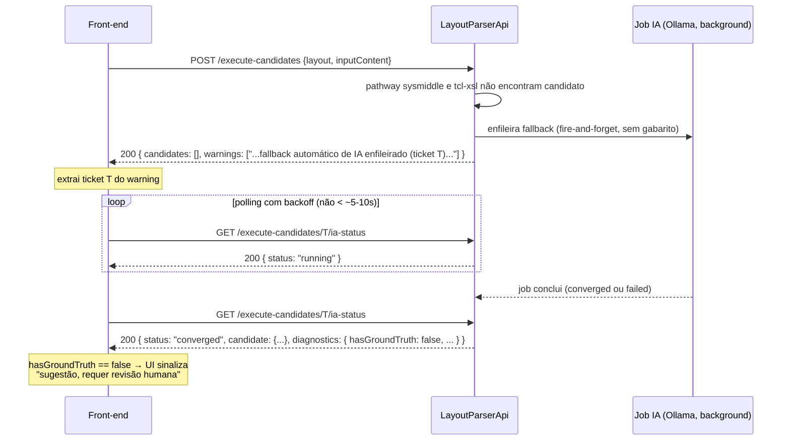

# Aviso: fallback automático de IA em `execute-candidates` exige polling — resultado não vem no array síncrono

**De:** `@lp-doc` (Duda), a pedido de `@lp-architect` (Aria) · **Para:** equipe front-end (LayoutParserReact) · **Data:** 2026-08-17

## Resumo

O fallback automático de IA (issue #135, em `master`) já está ativo em produção. Quando nenhum
candidato é encontrado pelos pathways síncronos (`sysmiddle`/`tcl-xsl`), a API dispara a IA em
background e devolve um **sinal** na resposta síncrona — não o resultado. O resultado só existe
via **polling** num endpoint separado. Se o front não consultar esse endpoint, o comportamento
observado é exatamente "a IA gera, mas o front não acha" — o job roda e conclui, só que ninguém
nunca vai buscar o resultado.

## 1. O que mudou

Antes: se `POST /api/transformationexecution/execute-candidates` não encontrasse nenhum candidato
via sysmiddle/tcl-xsl, a resposta síncrona vinha com `candidates: []` e um warning genérico —
fim de linha, nenhuma ação subsequente da API.

Agora: quando `candidates.Count == 0` **e** nenhum dos dois pathways falhou por infraestrutura
(timeout de runner, `.exe` ausente etc. — ver "Quando NÃO dispara" abaixo), a API enfileira em
background um job de IA (loop Ollama gerar → validar → corrigir) para tentar produzir um
candidato mesmo sem gabarito de referência. A resposta síncrona de `execute-candidates` continua
vindo imediatamente (o job não atrasa nem bloqueia essa resposta), mas passa a carregar um sinal
de que o fallback foi disparado.

Fonte: `Controllers/TransformationExecutionController.cs:283-288` (`TryEnqueueAiFallback`, chamado
só quando `candidates.Count == 0`) e `docs/architecture/design-fallback-ia-automatico-2026-08-16.md`.

### Quando NÃO dispara

Se algum dos pathways síncronos falhou por **infraestrutura** (runner sysmiddle indisponível,
timeout, exceção de execução — `FailureKind.ExecutionInfraError`), o fallback **não** é
disparado: a causa é operacional, não falta de mapeamento, e a IA não tentaria "recriar" um mapper
que já existe e está correto. Nesse caso, a resposta síncrona já traz o warning específico do
pathway que falhou — não haverá um segundo warning de fallback de IA, nem ticket para pollar.

Há também um **cooldown de 4h por layout** (`AiFallbackSuppressionGate`): se um fallback já foi
tentado sem sucesso recentemente para o mesmo `LayoutGuid`, um novo `execute-candidates` não
dispara outra tentativa — a resposta síncrona traz um warning informando até quando o layout fica
suprimido, sem ticket novo para pollar.

## 2. Como saber que o fallback foi enfileirado

A resposta síncrona de `POST /api/transformationexecution/execute-candidates` é sempre o mesmo
shape (`TransformationExecutionCandidatesResponse`):

```json
{
  "success": true,
  "candidates": [],
  "recommendedCandidateId": null,
  "warnings": [
    "Nenhum candidato de transformação encontrado — fallback automático de IA enfileirado (ticket abc123...), consulte GET execute-candidates/abc123.../ia-status"
  ]
}
```

**Não há campo estruturado dedicado** (tipo `aiFallbackEnqueued: true` ou `aiTicket: "..."`) — o
sinal é uma **string de warning** no array `warnings[]`, com o texto exato acima
(`Controllers/TransformationExecutionController.cs:489`). O ticket a pollar está embutido nessa
string, entre `ticket ` e `)`. Se o front precisar de um campo estruturado em vez de parsear a
string, é mudança de contrato — sinalizem para o backend, isso não existe hoje.

Para distinguir esse warning dos outros dois casos que também produzem warning sem candidato
(falha de infra do pathway, ou cooldown ativo), o texto de cada um é literal e diferente:

| Situação | Warning literal |
|---|---|
| Fallback de IA enfileirado | `"Nenhum candidato de transformação encontrado — fallback automático de IA enfileirado (ticket {ticket}), consulte GET execute-candidates/{ticket}/ia-status"` |
| Cooldown ativo (fallback suprimido) | `"Pathway IA fallback suprimido para este layout até {HH:mm} (já tentado sem sucesso)"` |
| Falha de infra do pathway sysmiddle (sem fallback) | `"Candidato {mapperGuid} (pathway sysmiddle) falhou: {mensagem}"` |

Se o front precisar detectar programaticamente, hoje a única forma confiável é checar se alguma
string em `warnings[]` **começa com** `"Nenhum candidato de transformação encontrado — fallback
automático de IA enfileirado"` e extrair o ticket dela.

## 3. Contrato do polling

```
GET /api/transformationexecution/execute-candidates/{ticket}/ia-status
```

Requer autenticação (`[Authorize]`) — o ticket é particionado por usuário: consultar o ticket de
outro usuário devolve `404`, nunca `403` (issue #92, deliberado — não confirma nem nega que o
ticket exista para outra pessoa).

### Payload de resposta (`AiCandidateStatus`)

```json
{
  "status": "running | converged | failed | not-applicable | not-found",
  "candidate": {
    "candidateId": "string",
    "pathway": "ia",
    "transformedXml": "string",
    "score": null,
    "segmentMappings": null,
    "validation": null,
    "failureReason": null
  },
  "diagnostics": {
    "iterations": 0,
    "remainingDiffs": 0,
    "xsdValid": false,
    "lastError": null,
    "hasGroundTruth": false
  }
}
```

Fonte: `Services/Transformation/Ai/AiTransformationModels.cs`.

- **`status`** — valores possíveis (constantes em `AiCandidateStatus`): `running` (job em
  andamento), `converged` (terminou com sucesso), `failed` (terminou sem convergir),
  `not-applicable`, `not-found` (ticket inexistente/expirado/de outro usuário — API responde
  HTTP `404` nesse caso, não incluído no corpo).
- **`candidate`** — só preenchido quando `status == "converged"`. `pathway` sempre `"ia"` nesse
  caso.
- **`diagnostics.lastError`** — só preenchido quando `status == "failed"`.
- **`diagnostics.hasGroundTruth`** — ver seção 4, é o campo mais importante para a UI.

### Frequência de polling recomendada

Não há SLA/medição formal de duração documentada, mas os tetos de configuração dão uma faixa de
referência: o job tem um teto técnico de sanidade de **45 minutos**
(`AiTransformationCandidateOptions.SanityTimeoutMinutes`, `appsettings.json:31`) e o ticket fica
consultável por **72h** depois de concluído (`TicketTtlHours`, `appsettings.json:32`) — isso é
teto/retenção, não estimativa de duração típica. Ollama roda localmente e o loop
gerar→validar→corrigir pode levar minutos, não segundos.

**Não pollem a cada 1s.** Recomendação: intervalo inicial de alguns segundos (5-10s) com backoff
progressivo (ex.: dobrar até um teto de ~30-60s), parando ao receber `converged`, `failed`,
`not-applicable` ou `not-found`. Se decidirem por um intervalo fixo, algo como 10-15s é um ponto
de partida razoável dado o teto de 45min — mas não é número medido, é estimativa por proxy. Se
precisarem de um valor validado, peçam ao `@lp-backend-dev` para instrumentar duração real do job
em log (mesma recomendação já feita em `resposta-proposta-frontend-progresso-parse-2026-08-14.md`
para o pathway de parse).

## 4. Como tratar `diagnostics.hasGroundTruth == false` na UI

Este é o sinal semântico mais importante do contrato. Quando um candidato IA converge:

- **`hasGroundTruth == true`** (candidato do pathway IA "normal", issue #40): a IA convergiu
  comparando contra um gabarito real produzido pelo pathway sysmiddle (diff canônico == 0). É o
  caso de mais confiança.
- **`hasGroundTruth == false`** (candidato originado do **fallback automático**, Estado A do
  design): não existe gabarito algum para este layout — nenhum mapper sysmiddle cadastrado, nada
  para comparar. O critério de convergência aqui é mais fraco (XSD válido + validação de negócio,
  sem diff estrutural contra referência). `diagnostics.remainingDiffs` fica `0` mesmo nesse caso,
  porque não há diff a contar — **não leiam `remainingDiffs == 0` como "validado"; quando
  `hasGroundTruth == false` esse campo é estruturalmente vazio, não um sinal de qualidade.**

Semanticamente: um candidato com `hasGroundTruth == false` é uma **sugestão da IA para revisão
humana**, nunca uma transformação pronta para produção. A UI precisa comunicar essa diferença de
confiança de alguma forma perceptível — não estamos prescrevendo o design (badge, cor, texto de
aviso, bloqueio de "aprovar direto" etc., fica a critério do front), só deixando claro que tratar
os dois casos de forma visualmente idêntica passaria uma confiança que o backend não tem base para
garantir.

## 5. Exemplo de fluxo completo



Se o job falhar (`status: "failed"`), `diagnostics.lastError` traz o motivo — não há retry
automático embutido nesse ticket; um novo `execute-candidates` respeitaria o cooldown de 4h antes
de tentar de novo para o mesmo layout (seção 1, "Quando NÃO dispara").

## Referências

- `docs/architecture/design-fallback-ia-automatico-2026-08-16.md` — desenho original (Estados A/B,
  critérios de disparo, cooldown).
- `Controllers/TransformationExecutionController.cs:168-521` — implementação (`ExecuteTransformationCandidates`,
  `TryEnqueueAiFallback`, `GetAiCandidateStatus`).
- `Services/Transformation/Ai/AiTransformationModels.cs` — shape exato de `AiCandidateStatus`/`AiCandidateDiagnostics`.
- `Models/Transformation/TransformationCandidate.cs` — shape de `TransformationExecutionCandidatesResponse`/`TransformationCandidate`.
- `docs/architecture/resposta-proposta-frontend-progresso-parse-2026-08-14.md` — mesmo padrão de
  polling por ticket, já adotado para o pathway de transformação low-code.
