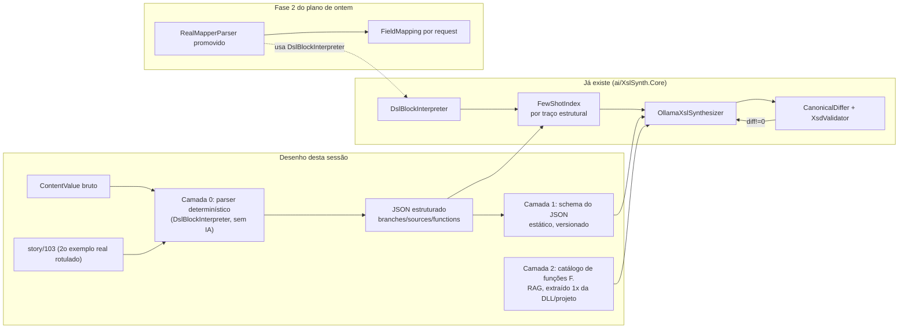

# Desenho — contexto/prompt da DSL do Mapper Sysmiddle para IA (Ollama)

> PT-BR. Missão `ai-vision` + `design-feature` (Aria). Desenho apenas — implementação é
> da Lia. Fonte primária: amostra real em `.claude/tmp/story/103/` (`MAP_f31a...xml`,
> 2 layouts). Relacionado a `plano-execucao-mapeamento-campo-txt-xml-2026-08-16.md`
> (Fases 0-3) e a `ai/XslSynth.Core` (loop gerar→validar→corrigir já existente).

## 1. A legenda da DSL (confirmada na amostra real)

Prefixos de token dentro de `ContentValue` de cada `Rule`:

| Prefixo | Papel | Confirmado na amostra |
|---|---|---|
| `#.` | variável local (escopo da rule) | `#.campoChaveAcesso`, `#.tamanhoChaveAcesso` |
| `$.` | variável global (escopo do mapper) | `$.buildChaveAcesso`, `$.validaPBCOP` |
| `N.` | nova instância (grupo repetido) | não presente no exemplo da chave; existe no padrão |
| `I.` | elemento de origem (input layout) | `I.LINHA000/ChaveAcesso`, `I.LINHA001/CodigoDaUFDoEmitente001` |
| `T.` | elemento de destino (target layout) | `T.enviNFe/NFe/infNFe/Id` |
| `F.` | função (customizada NDD ou padrão Connect Us) | `GetLength(...)`, `ConcatString(...)`, `CalculateVerifierDigit(...)`, `IsNullOrEmpty(...)`, `IsNullOrEmpty(...) != True()` |
| `S.` | atalho (raro, semântica não confirmada) | ausente na amostra — tratar como desconhecido, não inventar semântica |

Estruturas de controle confirmadas no exemplo real: `if/else` aninhado (3 níveis), com
operadores `&&`, `!=`, comparação de tamanho de string. `for`/`foreach`/`while` não
aparecem nesta regra específica mas são citados pelo dono como parte do mesmo padrão.

Achado importante da amostra: a regra da chave de acesso **não é um mapeamento 1:1**.
É uma árvore de decisão com fallback em 3 camadas (chave completa de 44 chars → chave
truncada + dígito verificador calculado → reconstrução a partir de UF+data+campos de
duas posições de layout diferentes). Isso é o caso comum, não a exceção — reforça por
que regex sobre `ContentValue` (mencionado como risco na Fase 2 do plano de ontem) é
insuficiente; é preciso um parser real de expressão/bloco, e é exatamente isso que
`DslBlockInterpreter.cs` (em `ai/XslSynth.Core/Core/`) já começou a fazer.

## 1.1 Motor de execução: hipótese Roslyn — precisa de confirmação do dono antes da Fase 1-2

O dono indicou que o low-code interpreta `if/else/for/foreach/while` via Roslyn
(`Microsoft.CodeAnalysis.CSharp.Scripting`), sugerindo trocar o parser regex do
`RealMapperParser` por `SyntaxTree`/`SemanticModel` real do Roslyn sobre `ContentValue`.
Isso mudaria a estratégia da Fase 1-2 do plano de ontem de forma relevante — mas a
amostra real (`story/103`) tem duas características que **não são C# válido**:

- `if(#.tamanhoChaveAcesso = 44)` — comparação com `=` simples, não `==`. Em C# isso
  seria atribuição (e nem compilaria dentro de uma condição `if` sem cast bool).
- `begin ... end` no lugar de `{ ... }`.

Duas hipóteses, com implicações de arquitetura bem diferentes:

- **(A) Roslyn entra depois de uma tradução.** O engine tokeniza/parseia a DSL
  proprietária (`begin/end`, `=` de comparação, prefixos) com um parser próprio do
  Sysmiddle e **gera** C# equivalente internamente, aí sim compilado/rodado via Roslyn
  Scripting — o Roslyn nunca vê o `ContentValue` bruto. Nesse caso, `RealMapperParser`
  continua precisando de um parser próprio para o `ContentValue` bruto (não pode
  delegar ao `Microsoft.CodeAnalysis.CSharp` para o texto tal como está no XML) — mas o
  achado ainda é valioso: ele diz que **existe** uma gramática formal e determinística
  por trás (não é ad-hoc), o que justifica investir num parser real (tokenizer +
  parser recursivo-descendente ou ANTLR) em vez de regex incremental, e há chance de
  existir uma referência da tradução DSL→C# no próprio código do Sysmiddle/`ConnectUs.Functions`
  que ajudaria a espelhar as regras de tradução.
- **(B) `ContentValue` É pré-processado antes de chegar no `MapperVO` salvo.** Se o que
  está no XML já for uma etapa intermediária (ex.: uma UI de baixo código que grava
  pseudocódigo e só na hora de rodar traduz pra C# real, aplicado sobre outro artefato
  que não vemos), o Roslyn `SyntaxTree` sobre o `ContentValue` do XML simplesmente não
  se aplica — mas nossa necessidade (extrair `I.`→`T.` e a árvore condicional) não muda:
  continuamos precisando parsear o texto como está gravado.

**Pergunta específica para o dono (via coordenador, não suposição minha):** o `=` de
comparação simples e o `begin/end` do `ContentValue` — isso é a sintaxe *literal* que o
Sysmiddle roda (ele mesmo tem um parser/tradutor pra isso antes do Roslyn), ou existe uma
etapa de normalização/tradução que já não vemos nesta amostra (ex.: o low-code editor
salva assim mas gera outro artefato C# real em algum lugar)? A resposta decide se vale a
pena `RealMapperParser`/`DslBlockInterpreter` tentar usar `Microsoft.CodeAnalysis.CSharp`
diretamente (só funciona se o texto for C# válido) ou se o caminho certo continua sendo
um parser dedicado da gramática Sysmiddle (tokenizer próprio, formalizado — não regex
solto), independente de Roslyn.

**Recomendação enquanto isso não é respondido:** não trocar `DslBlockInterpreter` por
Roslyn `SyntaxTree` sem essa confirmação — o risco de queimar trabalho em cima de uma
hipótese que a própria amostra contradiz (sintaticamente) é maior que o ganho especulado.
Se a resposta for (A) com uma referência de tradução disponível, isso vira insumo novo
pra Fase 1 do plano de ontem (ainda não fechada); se for "não sei, é só o que está
gravado mesmo", `DslBlockInterpreter` (parser dedicado) segue sendo a aposta certa e o
achado do dono ainda valida que **é uma gramática determinística real**, não freestyle.

## 2. Estrutura do prompt/contexto — camada estruturada primeiro, DSL bruta NUNCA vai pro Ollama

**Mudança de desenho em relação ao rascunho inicial, por instrução explícita do dono:**
o objetivo estratégico é viabilizar fine-tuning futuro do Ollama, e isso exige reduzir
drasticamente o espaço de entrada/saída que o modelo precisa aprender. Portanto o LLM
**não** interpreta `ContentValue` bruto a cada chamada — isso é caro, frágil e
inconsistente para fine-tunar. Todo o trabalho pesado de parsing determinístico
(gramática Sysmiddle, seja via parser dedicado ou, se a resposta do §1.1 confirmar,
Roslyn) acontece **antes**, em C# nosso, e produz uma representação estruturada e
simplificada — só essa representação entra no prompt.

Exemplo do formato-alvo (produzido pelo parser, não pelo LLM) para a regra da chave de
acesso:

```json
{
  "ruleId": "RUL_a7c1ce5b-32dc-4032-bcdd-cf53714a5f0c",
  "name": "Regra_chaveDeAcesso",
  "targetXPath": "enviNFe/NFe/infNFe/Id",
  "branches": [
    { "condition": "len(chaveAcesso) == 44", "sources": ["I.LINHA000/ChaveAcesso"], "functions": ["ConcatString"] },
    { "condition": "35 < len(chaveAcesso) < 44", "sources": ["I.LINHA000/ChaveAcesso"], "functions": ["ConcatString", "CalculateVerifierDigit"] },
    { "condition": "else", "sources": ["I.LINHA001/CodigoDaUFDoEmitente001", "I.LINHA001/DataDeEmissaoDoDocumentoFiscal001", "I.LINHA001/DataHoraEmissaoDocumento"], "functions": ["..."] }
  ]
}
```

Isso muda o papel de cada camada:

- **Camada 0 (nova, faz o trabalho pesado, sem IA).** Parser determinístico
  (`DslBlockInterpreter`/`RealMapperParser`, ajustado conforme §1.1) transforma
  `ContentValue` bruto → JSON estruturado acima. 100% código, sem chamada ao Ollama.
- **Camada 1 — Gramática do formato estruturado (não mais da DSL bruta).** O que a IA
  recebe como "linguagem" agora é o JSON simplificado, não `#.`/`$.`/`begin/end`. O
  prompt ensina o *schema* dessa representação (campos `branches`, `condition`,
  `sources`, `functions`), que é muito mais estável e compacto que a gramática Sysmiddle
  inteira — superfície de aprendizado menor, mais amigável a fine-tuning futuro.
- **Camada 2 — Catálogo de funções (`F.`), ainda por RAG (ver §5)**, mas agora referenciado
  por nome dentro do array `functions` do JSON, não por regex sobre texto livre.
- **Camada 3 — Few-shot dinâmico**, mas os exemplos armazenados no índice também passam a
  ser pares (JSON estruturado → efeito), não (`ContentValue` bruto → efeito). O
  `FewShotIndex` existente indexa por "traço estrutural" — isso já é compatível com essa
  mudança (é mais fácil de fazer bem em cima do JSON do que do texto bruto).

Uso nas duas direções do produto, revisado:
- **Extração** (Fases 1-3 de ontem): parser determinístico produz o JSON; a IA só entra
  se houver ambiguidade que o parser não resolve sozinho (ex.: nomear semanticamente o
  campo fiscal a partir do XPath, quando o catálogo GUID→XPath da Fase 2 não tiver
  anotação humana) — nunca para decidir a lógica condicional em si.
  ganho concreto disso: separa "extrair estrutura" (sempre determinístico) de "nomear/
  explicar" (onde IA ajuda), consistente com a recomendação two-step de 2026-08-14 (§4).
- **Geração** (visão de longo prazo, §6): a IA aprende a produzir o JSON estruturado
  (não o `ContentValue` DSL bruto) a partir de layout+gabarito+regra fiscal em linguagem
  natural; uma etapa determinística separada (transpilador, nos moldes do
  `DeterministicXslTranspiler` já existente) converte o JSON estruturado de volta para
  `ContentValue`/XSLT real. Isso é o mesmo padrão do `ai/XslSynth` hoje (LLM só entra
  guiado por erro concreto, nunca gera a saída final sem verificação) — só move a
  fronteira do LLM para um nível de abstração mais alto e mais estável.


Três camadas, para caber no padrão RAG já existente e não virar um prompt monolítico:

**Camada 1 — Gramática (estática, sempre no contexto).** Descrição compacta e formal
dos 6 prefixos + estruturas de controle + operadores, cada um com 1-2 exemplos mínimos
sintéticos (não os reais — reserva os reais pro few-shot). Objetivo: a IA nunca confunda
`#.` com `$.` nem trate `I.`/`T.` como texto livre. Vive como constante versionada no
código (ex.: `ai/XslSynth.Core/Prompting/DslGrammar.cs` ou `.md` carregado em runtime),
não hardcoded dentro de cada prompt individual — muda pouco, é reusada em toda chamada.

**Camada 2 — Catálogo de funções (`F.`) indexado, recuperado por RAG.** Ver §5 — não
cabe elenco fixo, cresce com o tempo.

**Camada 3 — Few-shot dinâmico (recuperado, não fixo).** Pares reais `Rule` → efeito
(origem(ns) I. → destino T., com a árvore de decisão resolvida) recuperados por
similaridade estrutural — isto é literalmente o papel de `Synthesis/FewShotIndex.cs`
(`ai/XslSynth.Core`), que já indexa `MapperRule` por traço estrutural. Não é preciso
construir um novo mecanismo de retrieval — é preciso **alimentá-lo com mais exemplos
rotulados** (a amostra `story/103` é o segundo caso real disponível; o primeiro é o
`sample/` sintético) e, quando o objetivo for extração (não geração), invertê-lo: dado
uma `Rule` desconhecida, recuperar as `k` mais parecidas já resolvidas, para ancorar
a interpretação da árvore condicional.

Uso pretendido nas duas direções do produto:
- **Extração** (Fases 1-3 de ontem): dado `ContentValue`, produzir `FieldMapping[]`
  (origem(ns) `I.<Linha>/<Campo>` → destino `T.<XPath>`, incluindo qual ramo condicional
  foi de fato exercitado para o documento em questão). Aqui a IA é auxiliar de um parser
  determinístico (`DslBlockInterpreter`), não a fonte da verdade — mesmo princípio não
  negociável do `ai/XslSynth`: nenhuma saída do LLM sem verificação de código.
- **Geração** (visão de longo prazo, §4): dado layout + gabarito SEFAZ + regra fiscal
  em linguagem natural, produzir `ContentValue` novo nesta DSL, ou XSLT equivalente.

## 3. Onde se encaixa — mesma trilha, pré-requisito da Fase 2



Não é trilha nova nem apenas um "prompt melhor" solto — é **o insumo que faltava para
a Fase 2 do plano de ontem funcionar em casos reais**, e é a mesma peça que reforça o
loop de síntese já existente:

- A Fase 2 assumia risco explícito: *"DSL condicional pode ter ramificações não
  cobertas por regex simples... considerar interpretador real"* — a gramática (Camada 1)
  e o `DslBlockInterpreter` já apontam para essa resposta; este desenho formaliza como
  a IA usa esse interpretador em vez de tentar ler `ContentValue` livre.
- O few-shot (Camada 3) é o mesmo mecanismo do `ai/XslSynth`, alimentado por mais 1
  caso real rotulado (`story/103`). Não duplica RAG — estende o corpus.
- Não substitui o marco de validação comportamental da Fase 2 (comparar contra o
  `.exe` real) — a IA continua sendo *assistente do parser determinístico*, o `.exe` e
  o diff continuam sendo o juiz.

## 4. Fecha a recomendação anterior de two-step (extração vs. geração)

Sim. Na investigação de 2026-08-14 (`sessao-usuario-e-artefatos-compartilhados`, não
encontrada nesta sessão mas referenciada) já havia a recomendação de separar "extrair
regra fiscal estruturada" de "gerar XSLT". A gramática da DSL é exatamente o vocabulário
comum às duas etapas: a extração usa a gramática para *ler* `ContentValue` real; a
geração usa a mesma gramática para *escrever* `ContentValue`/XSLT novo. Ter as 3 camadas
divididas (gramática estática / funções RAG / few-shot dinâmico) é o que permite reusar
o mesmo contexto nas duas direções sem reescrever prompt por etapa.

## 5. Funções customizadas (`F.`) — como entram no RAG

Sem acesso a `D:\Projetos\git.ndd\ConnectUs.Functions.*` nem à DLL nesta sessão —
não tentei acessar, e não devo assumir que existem localmente nesta máquina.

Desenho proposto (execução é da Lia, quando o dono disponibilizar os caminhos):

1. **Extração de assinaturas, uma vez, offline.** Para o projeto NDD: parse do código-fonte
   C# (nomes de método público + parâmetros + tipo de retorno + doc XML se houver). Para a
   DLL de terceiro (`SysMiddle.ConnectUs.Functions.dll`): reflection (`System.Reflection`)
   sobre tipos públicos — não decompilação (mesma ressalva de licenciamento já registrada
   no plano de ontem para o `.exe`; DLL referenciada via reflection de assinatura pública
   é diferente de decompilar lógica interna, mas vale confirmar com o dono antes).
2. **Indexar como um catálogo separado, recuperado por nome de função**, não por
   similaridade textual livre — quando `ContentValue` contém `F.NomeDaFuncao(...)`, o
   catálogo é consultado por match exato de nome, injetando assinatura + descrição no
   prompt. Mais barato e mais preciso que RAG semântico para esse caso (é lookup, não
   busca fuzzy).
3. **Fallback explícito para função desconhecida.** Se `F.X` não estiver no catálogo
   (função nova, não indexada ainda), o prompt deve dizer isso à IA explicitamente
   ("função não catalogada — não invente comportamento") em vez de permitir alucinação
   de semântica — dado o histórico do projeto com funções fiscais (CFOP, dígito
   verificador), inventar poderia produzir XML fiscalmente inválido silenciosamente.
4. Reavaliar quando os caminhos existirem: `.claude/agent-memory/lp-architect/` recebe
   memória apontando onde ficam (referência), não o catálogo em si (isso é artefato de
   implementação, não memória).

## 6. Viabilidade: eliminar a Sysmiddle é visão de longo prazo, não entrega desta sessão

Seja honesta é a instrução — então: **não**, isto não elimina a Sysmiddle agora, e não
deveria ser vendido como se fosse. O que este desenho entrega com RAG (sem fine-tuning)
é incremental e real:

- Curto prazo (semanas): melhora a extração determinística assistida por IA (Fases 1-3
  de ontem) — a IA ajuda a interpretar árvores condicionais complexas, com o `.exe` e o
  diff continuando como juiz. Isso já teria valor de produto (`fieldMappings` no front)
  sem depender de fine-tuning.
- Médio prazo: com mais mapeadores reais rotulados (cada `story/NNN` novo é mais um par
  de treino/few-shot), o loop RAG começa a **gerar** (não só extrair) regras simples
  (mapeamentos diretos, condicionais rasos) com confiança, sempre atrás do verificador
  diff+XSD.
- Longo prazo (fine-tuning): eliminar a Sysmiddle por completo — gerar `ContentValue`
  correto para árvores de decisão fiscal complexas como a da chave de acesso, sem
  supervisão — exige um corpus rotulado bem maior do que 2 exemplos, e contradiz
  diretamente o princípio atual do projeto ("RAG + auto-correção, não fine-tuning",
  README/CLAUDE.md). **Isto é uma proposta de evolução de princípio, não uma correção
  de rota** — sinalizo para o coordenador decidir se/quando atualizar o CLAUDE.md; não
  fiz essa mudança eu mesma.

Risco a registrar: hardware de produção é CPU-only, i7-4790 Haswell 2014 (ver memória
`production-server-hardware.md`) — fine-tuning real está fora de cogitação nesse
hardware; exigiria decisão de infra separada (VM externa, nuvem só para treino com
dado anonimizado, etc.) — fora do escopo deste desenho.

## 7. Sinalização de risco de dado sensível

`ContentValue` reais carregam campos fiscais de documentos de produção (chave de
acesso, UF, datas de emissão). Ollama local está OK (dado não sai — regra já vigente
em `security.md`). Se em algum momento cogitar usar um provedor cloud para
fine-tuning, isso re-abre a mesma barreira de "não enviar dado de cliente sem
autorização explícita" já registrada no security.md — não é uma decisão nova, só
reforço de que a visão do §6 (longo prazo) não pode assumir cloud sem essa aprovação.
