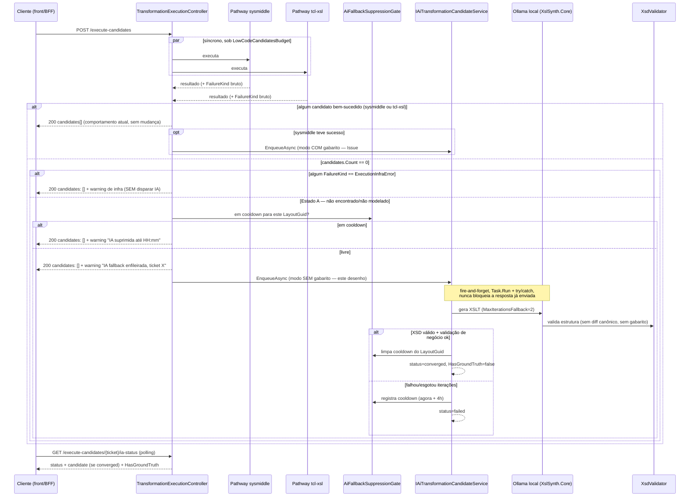

# Fallback automático de IA — quando nenhum pathway resolve (2026-08-16)

> Autoria: `@lp-architect` (Aria) · Implementação: `@lp-parser-llm` (Lia, geração) →
> `@lp-backend-dev` (Dex, controller/DI) → `@lp-qa` (Quinn, gates) → `@lp-doc` (Duda, manual) →
> `@lp-devops` (Gage, PR/merge — já autorizado). Status: desenho aprovado, pronto para
> implementação sem retorno à arquitetura. Complementa, **não substitui**,
> [`pathway-ia-execute-candidates.md`](pathway-ia-execute-candidates.md) (Issue #40) — aquele
> desenho cobre o caso "sysmiddle resolveu, IA converge para o mesmo gabarito"; este cobre o caso
> oposto, "nada resolveu, não existe gabarito".

---

## 0. O gap, em uma frase

Hoje `AiCandidateDispatchPlan.TryBuild` só dispara o pathway IA quando existe um candidato
`sysmiddle` bem-sucedido (linha 30-32 de `AiCandidateDispatchPlan.cs`: `if (groundTruth == null)
return null`). Quando **nenhum** dos dois pathways síncronos (`sysmiddle`, `tcl-xsl`) produz
candidato, a IA nunca é chamada — o request retorna `candidates: []` com warnings e nada mais
acontece. Este documento fecha esse segundo gap, reaproveitando ao máximo a infraestrutura já
construída para o Issue #40 (`IAiTransformationCandidateService`, `AiCandidateStore`, endpoint de
status, particionamento por usuário) — é extensão, não reconstrução.

---

## 1. Gatilho — onde, e síncrono vs. assíncrono

**Onde:** dentro de `TransformationExecutionController.ExecuteCandidates` (`execute-candidates`),
logo após a mesma linha onde hoje `TryEnqueueAiCandidate` já é chamado (linha 269). Não um novo
endpoint, não `ParseController.Upload` — `execute-candidates` já é o ponto único onde os dois
pathways síncronos terminam e a decisão pode ser tomada com o resultado final de ambos. Colocar o
gatilho em `ParseController.Upload` duplicaria a decisão em dois lugares (Upload já delega a
`execute-candidates` para candidatos — ver `transformation-pathway-duplication.md`); manter um
único ponto de decisão evita repetir esse erro já mapeado.

**Síncrono vs. assíncrono: assíncrono, mesmo padrão de ticket do Issue #40.** Não é uma decisão
nova — é a mesma decisão já fechada e justificada em `pathway-ia-execute-candidates.md` §3.1
(Ollama pode levar minutos; colocar como terceira `Task` síncrona ou estoura o teto de
`LowCodeCandidatesBudget` para todo mundo, ou a IA nunca teria janela para terminar). Nada nesta
missão muda esse cálculo — ao contrário, o caso "nada resolveu" é o que mais precisa de paciência
(gerar do zero é mais difícil que corrigir contra um gabarito). Reaproveita:

- `IAiTransformationCandidateService.EnqueueAsync`/`GetStatusAsync` (mesma interface).
- `GET /execute-candidates/{ticket}/ia-status` (mesmo endpoint, sem endpoint novo).
- `AiCandidateStore` particionado por `userId` (issue #92, já implementado).

O único elemento novo de contrato é o **modo** em que `EnqueueAsync` roda quando não há
`groundTruthXml` — ver §2 e §6.

---

## 2. Escopo do "nenhum pathway resolve" — a distinção que decide tudo

Duas condições parecem "nada resolveu" mas são semanticamente opostas. O desenho trata como
**dois estados diferentes**, com gatilho de IA só no primeiro:

| Estado | Sintoma | O que significa | Dispara IA? |
|---|---|---|---|
| **A — Não encontrado / não modelado** | `sysmiddle` retorna `Applicable == false`, ou não existe mapper cadastrado para o `LayoutGuid`, ou `tcl-xsl` retorna "sem heurística aplicável" | Não existe transformação para este layout ainda — é um gap real de cobertura | **Sim** |
| **B — Encontrado, mas falhou por infraestrutura** | Mapper existe (`sysmiddle` reconhece o layout) mas a execução falha por `SysmiddleDir`/`RunnerPath` ausente, timeout do runner x86, processo `.exe` não encontrado, erro de configuração — o caso já diagnosticado em `diagnostico-mapper-nao-encontrado-producao-2026-08-15.md` | A transformação **existe e está correta** — só a infra está mal configurada | **Não** |

**Por que essa distinção é inegociável:** se a IA disparasse no Estado B, ela tentaria "recriar"
uma transformação que já existe e é a fonte de verdade (sysmiddle é sempre o gabarito — princípio
já fixado em `pathway-ia-execute-candidates.md` §2.1). Na prática o modelo geraria um XSLT
alternativo para um problema que não é de transformação, é de deploy/config — desperdiça o Ollama
lento, produz um candidato espúrio, e pior: se alguém aceitar esse candidato por engano, ele
diverge silenciosamente do que a Sysmiddle realmente faria uma vez a infra corrigida. O sintoma
correto para o Estado B é o warning que já existe hoje (`"Pathway sysmiddle falhou: ..."`,
sanitizado por `LowCodeErrorSanitizer`) — nada muda aí.

**Como detectar a diferença no código, concretamente:** o candidato de fracasso já carrega
`FailureReason` (`TransformationCandidate.FailureReason`). Classificar por padrão de mensagem já
sanitizada não é confiável (a sanitização existe exatamente para não vazar detalhe de infra pro
cliente da API) — em vez disso, o pathway sysmiddle já sabe internamente (antes de sanitizar) se a
falha veio de `LowCodeRunnerOptions` ausente/inválido ou de exceção do runner (infra) vs. mapper
não encontrado no catálogo (`Applicable == false`, cobertura). A distinção deve ser feita **na
origem** (dentro de `ExecuteSysmiddleCandidatesAsync`/`LowCodeAutoTransformationService`), não
inferida depois por regex sobre a mensagem sanitizada — adiciona um campo interno
`FailureKind { NotApplicable, ExecutionInfraError }` ao resultado bruto (antes da sanitização),
sem expor esse enum na resposta pública da API (é sinal interno para o gatilho de IA, não contrato
de cliente). `AiCandidateDispatchPlan` decide com base nesse campo, nunca com base no texto do
warning.

**Regra final:** IA dispara em `execute-candidates` quando, ao final dos dois pathways síncronos,
`candidates.Count == 0` **E** nenhum resultado bruto tem `FailureKind == ExecutionInfraError`. Se
qualquer resultado bruto (sysmiddle ou tcl-xsl) indicar erro de infra, a IA não dispara — o
warning de infra já é o sinal correto e correção é operacional, não geração.

---

## 3. Segurança / dado sensível

Nenhum caminho novo para nuvem. O serviço reaproveitado (`IAiTransformationCandidateService`,
já implementado para o Issue #40) já usa exclusivamente `OllamaXslSynthesizer` — local, sem
Gemini/OpenAI (decisão fechada em `gemini-openai-decommission-decision.md`). Este desenho não
introduz um provedor novo nem uma rota de dado diferente: o `inputContent` (TXT/XML do documento
fiscal) que hoje já trafega para o loop de correção do Issue #40 é o mesmo que trafegaria aqui —
a única diferença é que no Estado A não há `groundTruthXml` para comparar (ver §6). Confirmar na
implementação (`@lp-parser-llm`) que o modo sem gabarito também usa exclusivamente `Core/`+
`Synthesis/` de `ai/XslSynth` (ou a classlib extraída, §4.1 do desenho do Issue #40) — não criar
um segundo cliente Ollama nem reintroduzir `GeminiAIService`/`SemanticAIGenerator` (código morto
já mapeado para remoção, não ressuscitar).

---

## 4. Isolamento por usuário

Sem mudança de mecanismo: `EnqueueAsync`/`GetStatusAsync` já recebem `userId` (`ICurrentUser.Name`
resolvido no controller, issue #92) e a `AiCandidateStore` já particiona por
`{storePath}/{usuário}/{ticket}.json` + chave de memória `userId+ticket`. O ticket do Estado A usa
a mesma função `LowCodeTransformationStore.BuildTicketFromContent(inputContent, layoutGuid)` — os
dados de entrada para compor o ticket (conteúdo do documento + layout) existem mesmo sem
`groundTruthXml`, então o particionamento funciona idêntico ao Issue #40, sem caso especial.

---

## 5. Circuito de proteção — suppression cache global por layout+mapper

**Problema que só existe no Estado A e não no Issue #40:** no Issue #40, o "gabarito sempre
existe" já limita naturalmente quantas vezes a IA é chamada por combinação layout+conteúdo (o
ticket é determinístico por conteúdo — mesmo documento gera o mesmo ticket, então re-tentar em
cima do mesmo ticket é idempotente, não custo adicional). No Estado A, a ausência de mapper é
**estrutural** (o layout nunca teve transformação cadastrada) — qualquer novo upload de um
documento diferente para o mesmo layout sem cobertura dispara um novo ticket, e portanto uma nova
chamada cara ao Ollama, repetidamente, para um problema que a IA já sabe que não vai resolver
sozinha (ex.: mapper realmente não existe e precisa ser criado por um humano, não gerado).

**Decisão: cache de supressão global (não particionado por usuário), chave = `LayoutGuid` (não o
ticket completo — layout, não documento específico).** Diferente da `AiCandidateStore` (por
usuário, por ticket), este é um mecanismo novo e deliberadamente **cross-usuário**: se o usuário A
já tentou o Estado A para o layout X às 10h e falhou, o usuário B não deve re-disparar o mesmo
custo às 10h05 para um documento diferente do mesmo layout X — a causa raiz (layout sem
transformação modelável) é a mesma para os dois.

- Estrutura: `ConcurrentDictionary<Guid /*LayoutGuid*/, DateTimeOffset /*próxima tentativa permitida*/>`
  em um novo serviço `Singleton` `IAiFallbackSuppressionGate` (estado compartilhado, mesmo padrão
  de `LowCodeTransformationService`/`IConnectionMultiplexer` em `dotnet-standards.md`).
- Regra: ao falhar (ver §6 — não converge dentro de `MaxIterations`, ou erro fatal do Ollama),
  registra `LayoutGuid → agora + CooldownMinutes` (novo campo em `AiTransformationCandidateOptions`,
  default **240 minutos / 4h** — folgado o bastante para não bloquear retentativa manual do time
  no mesmo dia, curto o bastante para não travar indefinidamente se alguém cadastrar o mapper à
  tarde). Ao suceder, remove a entrada (se um dia convergir, próxima tentativa não fica em
  cooldown por engano).
- `TryEnqueueAiCandidate` consulta o gate **antes** de chamar `EnqueueAsync`: se em cooldown, não
  dispara, e o warning já existente ganha uma variante: `"Pathway IA fallback suprimido para este
  layout até {ProximaTentativa:HH:mm} (já tentado sem sucesso)"` — visível, não silencioso, para
  quem está debugando não achar que "nada aconteceu" sem explicação.
- Este gate é **em memória, não persistido** — reinício da API reseta o cooldown. Aceitável: pior
  caso é uma tentativa extra logo após um deploy, não um vazamento de custo indefinido. Não vale a
  complexidade de persistir para um mecanismo de higiene, mesma lógica já aplicada ao
  `SanityTimeoutMinutes` do Issue #40 (teto técnico, não SLA de produto).

---

## 6. Critério de sucesso — sem gabarito, o critério muda de "diff == 0" para "XSD válido + heurística estrutural"

Este é o ponto onde o Estado A **não pode** reusar o loop do Issue #40 goela abaixo — precisa de
um modo novo, mesmo reaproveitando os mesmos componentes de `ai/XslSynth`:

- **Issue #40 (com gabarito):** convergência = `CanonicalDiffer` reporta zero diffs contra
  `groundTruthXml` **e** `XsdValidator` passa. Critério duplo, forte.
- **Estado A (sem gabarito):** não existe `groundTruthXml` para diff — não há "certo" conhecido.
  Critério de sucesso vira: **(1)** `XsdValidator` passa (validação estrutural contra o schema
  SEFAZ — determinístico, não depende de IA) **e** **(2)** o XSLT gerado, aplicado ao
  `inputContent`, produz um XML que passa pela mesma cadeia de validação de negócio que o pathway
  `tcl-xsl` normalmente teria produzido (reaproveitar `Services/Testing`/validadores já existentes
  no pipeline, não inventar um terceiro validador). Sem diff estrutural, o resultado é
  necessariamente **menos confiável** que o do Issue #40 — isso precisa ficar explícito no
  contrato de resposta.

**Contrato:** `AiCandidateStatus.Diagnostics` ganha um campo booleano `HasGroundTruth` (default
`true` para preservar comportamento do Issue #40; `false` no Estado A). O `TransformationCandidate`
resultante do Estado A é marcado com `Score = null` (mesmo hoje) mas o front/consumidor da API
**deve** tratar um candidato `Pathway == "ia"` com `HasGroundTruth == false` como
"sugestão para revisão humana", nunca "pronto para produção" — isso é uma decisão de UX que cabe a
`@lp-parser-llm`/front articular na prática, mas o campo precisa existir desde já para não virar
retrabalho de contrato depois. Também é o motivo pelo qual `MaxIterations` do Estado A deve ser
mais conservador que o do Issue #40 (`MaxIterationsFallback`, novo campo em
`AiTransformationCandidateOptions`, sugestão default **2**, contra 3 do modo com gabarito) —
sem gabarito para convergir, iterações adicionais tendem a não melhorar a confiança do resultado,
só o custo.

---

## 7. Diagrama

---

## 8. Dispatch — o que cada agente executa

1. **`@lp-backend-dev` (Dex):** em `ExecuteSysmiddleCandidatesAsync`/`LowCodeAutoTransformationService`
   (e no equivalente `tcl-xsl`), adicionar o campo interno `FailureKind` (não exposto na resposta
   pública) distinguindo `NotApplicable` de `ExecutionInfraError` na origem — não por regex sobre
   warning sanitizado (§2). Adicionar `AiFallbackSuppressionGate` (`Singleton`, DI grupo
   Transformation). Em `TransformationExecutionController`, estender `TryEnqueueAiCandidate` (ou
   um `TryEnqueueAiFallback` irmão) para cobrir o Estado A conforme §7, incluindo a consulta ao
   gate antes de disparar.
2. **`@lp-parser-llm` (Lia):** estender `IAiTransformationCandidateService`/`EnqueueAsync` com um
   modo "sem gabarito" (`groundTruthXml` nullable — hoje é obrigatório) que troca o critério de
   convergência de diff canônico para XSD + validação de negócio (§6), usa `MaxIterationsFallback`,
   e ao final chama `AiFallbackSuppressionGate` para limpar/registrar cooldown. Adicionar
   `HasGroundTruth` a `AiCandidateDiagnostics`.
3. **`@lp-qa` (Quinn):** gate específico — (a) confirmar que `FailureKind == ExecutionInfraError`
   nunca dispara IA (teste de regressão explícito para o caso já diagnosticado em
   `diagnostico-mapper-nao-encontrado-producao-2026-08-15.md`); (b) confirmar que o cooldown do
   gate impede segunda chamada ao Ollama dentro da janela; (c) confirmar que um candidato
   `HasGroundTruth == false` nunca aparece com `Score` preenchido nem é escolhido como
   `RecommendedCandidateId`.
4. **`@lp-doc` (Duda):** documentar o novo warning/estado em `ia-status` e a semântica de
   `HasGroundTruth` no manual/README — deixar explícito para quem consome a API que um candidato
   sem gabarito é sugestão, não resultado validado por comparação.
5. **`@lp-devops` (Gage):** PR final, merge — já autorizado pelo dono do projeto.
