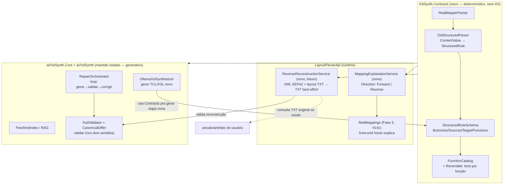

# Design — XslSynth.Core no runtime + reversibilidade TXT⇄XML (2026-08-16)

Contexto literal do dono: `ai/XslSynth.Core` precisa deixar de ser um repositório de
pesquisa isolado, porque a mesma representação estruturada (Camadas 0-2) que hoje
alimenta o loop offline de geração TCL/XSL é o que a API precisa devolver "mastigado"
ao front (`fieldMappings`, issues #139-141) e, futuramente, à IA para gerar/entender
mapeamentos nos dois sentidos: TXT→XML SEFAZ **e** XML SEFAZ→TXT (reconstituir o que o
cliente emitiu, dado o layout de input).

## 1. Acoplamento `XslSynth.Core` ↔ runtime — decisão

**Opção escolhida: extrair um terceiro projeto `XslSynth.Contracts` (ou promover
`RealMapperParser` + Camadas 0-1 puras para dentro dele), referenciado tanto por
`ai/XslSynth.Core` quanto por `Services/` da API — sem a API referenciar `XslSynth.Core`
inteiro.**

Isso já está parcialmente decidido no plano formalizado (`plano-execucao-mapeamento-
campo-txt-xml-2026-08-16.md`, Fase 1): "promover `RealMapperParser` a runtime" é
exatamente este movimento. O que falta explicitar é o *como*, porque `XslSynth.Core`
hoje é um bloco monolítico (parser DSL + XSLT transpiler + Ollama client + XSD validator
+ RAG/FewShot). Referenciar o projeto inteiro do `Program.cs` puxaria dependência de
Ollama/RAG (peso de build, superfície de teste, acoplamento de versão) pro caminho
crítico de request HTTP — quebra exatamente a razão do isolamento original.

Trade-off A (referenciar o projeto inteiro) vs B (extrair um core determinístico):

| | A — referenciar `XslSynth.Core` direto | B — extrair `XslSynth.Contracts` |
|---|---|---|
| Build/publish da API | Puxa Ollama client, RAG, XSD validator — peso e risco de quebra em cada mudança de pesquisa | Só o parser determinístico (Camada 0-1), sem I/O externo |
| Estabilidade do runtime | Acoplado ao ritmo de mudança da Trilha A (pesquisa evolui rápido) | Isolado — Contracts muda só quando o *schema* muda (já versionado, `SchemaVersion`) |
| Duplicação | Zero | Zero (é extração, não cópia) |
| Esforço agora | Nenhum (referência direta) | Um projeto novo + mover `DslStructuredParser`/`RealMapperParser`/`StructuredRuleSchema`/`FunctionCatalog`/`GuidXPathCatalog` pra lá |

**Decisão: B.** O isolamento original (`XslSynth.Core` fora do build da API) foi
deliberado por boa razão — não desfazer isso globalmente. Em vez disso, particionar:
o determinístico e sem side-effect (parser DSL→JSON, schema, catálogo GUID→XPath) vira
`XslSynth.Contracts`, referenciado pelos dois lados. O generativo (Ollama, RAG,
few-shot, CLI de pesquisa) continua isolado em `XslSynth.Core`/`XslSynth`. Isso é
literalmente o padrão que o projeto já usa para MCP (`mcp-usage.md`: "cliente fino
sobre a API, não duplica lógica") — aqui invertido: extrai o núcleo comum, não duplica.

**Ação para `@lp-parser-llm`:** ao endereçar a Fase 1, criar `XslSynth.Contracts.csproj`
(classlib, sem dependências externas) e mover para lá: `DslStructuredParser`,
`StructuredRuleSchema`/`StructuredRule`/`StructuredBranch`, `FunctionCatalog`,
`GuidXPathCatalog`, `RealMapperParser`, `MapperVo`. `Services/Transformation/` da API
referencia `XslSynth.Contracts.csproj` diretamente (`ProjectReference`), registrado em
DI como `Scoped` (padrão do projeto). `ai/XslSynth.Core`/`ai/XslSynth` passam a
referenciar `XslSynth.Contracts` também, em vez de conter essas classes.

## 2. Reversibilidade — veredito honesto

**Parcialmente viável, não "fácil".** A representação `StructuredRule` (Branches →
Sources/Target/Functions/Condition) é uma árvore de atribuição dirigida — target
depende de sources via funções. Isso *é* abstrato o bastante para, em princípio, ser
percorrido ao contrário (dado um `Target` populado no XML, achar `Sources` no TXT), mas
a inversão esbarra em três classes de problema real:

1. **Funções não-bijetoras.** `ConcatString` com delimitador ambíguo, `CalculateVerifierDigit`
   (dígito verificador — função com perda: o dígito não recupera o valor original),
   truncamento/padding, formatação de data com perda de century, etc. Essas não têm
   inversa determinística — a inversão exige heurística ou re-emissão do valor original
   armazenado em outro lugar (o próprio TXT, se disponível), não cálculo puro.
2. **N:1 (muitos campos TXT → um campo XML).** Fácil inverter 1:1; para agregações
   (concatenação, soma condicional) a inversão é ambígua sem informação adicional
   (delimitador conhecido resolve concat; soma não é invertível sem os operandos).
3. **Condições (`Branches`) dependem de dados de origem, não de destino.** A condição
   `len(campoChaveAcesso) == 44` é avaliável olhando o TXT; olhando só o XML de saída,
   nem sempre dá pra saber qual branch gerou aquele valor (branches diferentes podem
   produzir outputs indistinguíveis).

**Veredito:** reversão automática e genérica de qualquer `StructuredRule` **não deve
ser prometida**. O que é realmente viável e vale desenhar:
- Marcar cada `StructuredBranch`/função como `Reversible: bool` (metadado, não
  capacidade automática) — funções puramente estruturais (mapeamento posicional direto,
  sem perda) marcadas reversíveis; funções com perda (`CalculateVerifierDigit`,
  truncamento) marcadas não-reversíveis por padrão.
- Para o caso concreto que o dono descreveu ("XML SEFAZ + layout de input + selecionar
  transformação do TXT → devolver o TXT original"), a estratégia mais honesta **não é
  inversão pura da regra** — é usar o **próprio TXT original armazenado** (se
  disponível no histórico/sessão, ver `session-artifacts-sharing-design.md`) como
  fonte da verdade e a regra reversível como *validação* ("este XML, se re-transformado
  pra TXT usando a regra inversa, bate com o original?" — é o mesmo padrão de
  `CanonicalDiffer`/validação comportamental já usado na Fase 2 do plano #139-141).
  Quando o TXT original não está disponível, a reconstrução vira best-effort e deve
  ser sinalizada como tal (campos não-reversíveis ficam `null`/placeholder no output).

Isso é reaproveitável em domínio de negócio: o loop RAG existente (gerar→validar→
corrigir) já lida com "não sei gerar isso com certeza, tento e valido" — reversão
segue o mesmo espírito, não precisa de mecanismo novo, precisa da mesma disciplina de
validação aplicada ao sentido contrário.

## 3. Pipeline com direção como parâmetro

**Um pipeline só, com `Direction` (Forward | Reverse) como parâmetro — não dois
pipelines distintos.** Ambos os sentidos consomem a mesma `StructuredRule`
(Camada 0-1, agora em `XslSynth.Contracts`) e o mesmo `FunctionCatalog` (Camada 2), só
trocam qual lado é "conhecido" (sources vs target) e qual walker percorre a árvore.
Isso evita duplicar o parser DSL e o catálogo de funções — duplicar essas duas peças
seria o erro caro (são elas que absorvem a complexidade real da DSL Sysmiddle).

**Resumo do fluxo:** `XslSynth.Contracts` é o hub compartilhado. `Services/` da API
(runtime, sem Ollama) consome Contracts pra EXPLICAR mapeamento existente (Fase 3) e,
no futuro, pra tentar RECONSTRUIR o sentido inverso — sempre validando contra
`XsdValidator`/`CanonicalDiffer` do lado de pesquisa quando precisar gerar algo novo
(não reconstruir). `ai/XslSynth.Core`/`ai/XslSynth` continuam isolados do build/publish
da API — só ganham uma `ProjectReference` a mais (`Contracts`), não à API.

## 4. Impacto no plano formalizado (#139-141)

- **#139 (Fase 1) e #140 (Fase 2):** escopo não muda, mas a Fase 1 ganha uma tarefa
  técnica explícita que hoje está implícita em "promover `RealMapperParser`": criar
  `XslSynth.Contracts` como o mecanismo concreto dessa promoção (seção 1 acima). Vale
  adicionar essa tarefa à Fase 1 antes de a Lia começar, para não reinventar o "como"
  no meio da implementação.
- **#141 (Fase 3):** sem mudança — continua sendo "expor `fieldMappings`", que já é o
  caso Forward do pipeline acima.
- **Reversibilidade NÃO cabe em #139-141.** É escopo novo, maior, com risco central
  (funções não-bijetoras) que merece decisão própria do dono antes de comprometer
  prazo. Recomendo **nova issue "Fase 4 — Reconstrução reversa best-effort (XML→TXT)"**,
  explicitamente dependente da Fase 2 (catálogo GUID→XPath) e da Fase 1
  (`XslSynth.Contracts` existir), com o veredito da seção 2 como aceite: a issue deve
  nascer escopada como "best-effort com validação", não "reversão garantida" — para não
  criar expectativa que a DSL Sysmiddle não sustenta. Não vou criar essa issue — passar
  para `@lp-pm` formalizar com o dono.

## Arquivos consultados (não alterados)

- `ai/XslSynth.Core/Prompting/StructuredRuleSchema.cs`
- `ai/XslSynth.Core/Core/RealMapperParser.cs`, `DslStructuredParser.cs`
- `docs/architecture/plano-execucao-mapeamento-campo-txt-xml-2026-08-16.md`
- `.claude/agent-memory/lp-architect/xslsynth-trilha-a-overlap.md`
