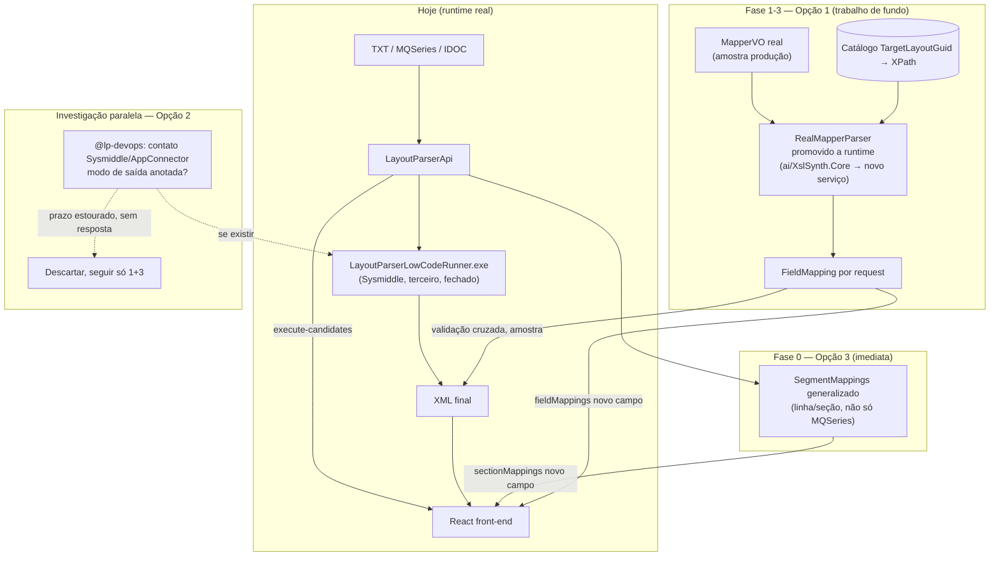

# Plano de execução — mapeamento campo TXT ↔ tag XML (PBI #128 / Epic #126)

> Continuação de `resposta-mapeamento-campo-txt-xml-2026-08-16.md` (develop, `408db78`).
> Aqui: qual opção seguir e as fases pra executá-la. Não implementa nada — plano pra
> outros agentes. Formalização em PBI (`@lp-pm`) só depois que o dono confirmar.

## 1. Recomendação

**Opção 3 imediata + Opção 1 como trabalho de fundo + Opção 2 como investigação paralela barata.**

Não são alternativas — são sequenciais/paralelas com propósitos diferentes:

- **Opção 3** desbloqueia o front *agora* com o dado que já existe (granularidade de
  seção/linha via `SegmentMappings`, hoje só no pathway MQSeries — precisa generalizar
  pros outros dois pathways). Não resolve o pedido original, mas é entregável em dias,
  não meses, e o front já pediu explicitamente algo pra não ficar bloqueado.
- **Opção 1** é o único caminho que resolve o pedido original (`fieldMappings` campo a
  campo) sem depender de terceiro. É trabalho real de projeto (promover
  `RealMapperParser` pra runtime), não uma extensão de contrato — vira trilha própria,
  liderada pela Lia.
- **Opção 2** corre em paralelo, sem bloquear nada: é uma pergunta a fazer (existe modo
  de saída anotada no `.exe`?), não uma tarefa de engenharia. Se a resposta vier "sim" a
  tempo, ela pode substituir/validar a Opção 1; se não vier em prazo curto, é descartada
  sem custo — nenhuma fase de execução dependeu dela.

**Por que não só Opção 1 (ignorar a 3):** o pedido do front já está em drift há tempo
(ver §1.3 da resposta anterior) e "campo a campo" é um projeto de meses. Entregar seção
primeiro é reduzir o tempo de bloqueio do time de UI sem comprometer a qualidade do
resultado final.

**Por que não só Opção 2 (esperar o fornecedor):** fora do nosso controle, sem prazo
garantido, e a resposta mais provável (produto fechado, sem cooperação formal com a NDD)
é "não". Não pode ser dependência de bloqueio de nenhuma fase.

## 2. Diagrama do fluxo proposto

## 3. Fases de execução

### Fase 0 — Generalizar `SegmentMappings` pros 3 pathways (Opção 3)
- **Título de PBI:** "Expor `sectionMappings` (granularidade de seção/linha) em
  `execute-candidates` nos pathways sysmiddle e tcl-xsl"
- **Dono:** `@lp-backend-dev` (Dex)
- **Escopo:** hoje `SegmentMappings` só é populado por `MqSeriesToXmlTransformer`. Levar o
  mesmo tipo (linha origem → segmento) pros pathways sysmiddle (`LowCodeTransformationService`)
  e tcl-xsl, na medida do que cada um já sabe sem parsear `MapperVO`. Renomear o campo
  exposto ao contrato pra `sectionMappings` (evitar confundir com `fieldMappings` futuro,
  que é granularidade diferente).
- **Critério de aceite:** os 3 pathways retornam `sectionMappings` não-nulo quando
  aplicável; contrato documentado como granularidade de linha/seção, explicitamente NÃO
  campo; front consegue destacar bloco de origem no TXT a partir da resposta.
- **Marco de validação:** `@lp-qa` (Quinn) confere, numa amostra de cada pathway, que o
  número de linha reportado bate com a seção real do TXT de entrada.
- **Dono de doc:** `@lp-doc` (Duda) atualiza o contrato HTTP documentado.

### Fase 1 — Confirmar shape real do `MapperVO` + decidir dono do parser
- **Título de PBI:** "Investigação: shape completo do `MapperVO` de produção e decisão de
  arquitetura do parser de runtime"
- **Dono:** `@lp-parser-llm` (Lia)
- **Escopo:** ler amostra de produção completa do `MapperVO` (não a amostra de síntese
  offline já usada por `RealMapperParser`); confirmar campos citados pelo front
  (`IsStaticValue`, `StaticValue`, `IsPositionalGroupRepetition`, `MinimalOccurrence`/
  `MaximumOccurrence`); decidir se `RealMapperParser` é promovido ou se nasce um parser
  novo dedicado a esse propósito (evitar acoplar a trilha de síntese offline a um serviço
  de runtime com SLA de request).
- **Critério de aceite:** documento com shape confirmado campo a campo + decisão
  registrada (promover vs. novo parser) + confirmação se `tcl-xsl` usa ou não `MapperVO`
  (pergunta em aberto da resposta anterior).
- **Marco de validação:** revisão por `@lp-architect` antes de Fase 2 começar — não avança
  sem essa confirmação (é o ponto que "muda o shape depois de publicado quebra o front").

### Fase 2 — Catálogo `TargetLayoutGuid` → XPath + resolução N:1 e grupos repetidos
- **Título de PBI:** "Construir catálogo GUID→XPath do layout de destino e resolver
  granularidade N:1 / ocorrência de grupo no parser de runtime"
- **Dono:** `@lp-parser-llm` (Lia), com apoio de `@lp-backend-dev` pra persistência do
  catálogo (provavelmente cache Redis + fallback SQL, seguindo o padrão de resiliência
  já usado no projeto)
- **Escopo:** resolver `TargetElementGuid` contra `TargetLayoutGuid` real (não mais
  heurística textual de `T.<path>`); parsear DSL além do regex atual pra extrair todas as
  origens `I.<Linha>/<Campo>` de uma rule (não só o destino); usar a ocorrência física real
  do parse (já calculada pela API — reaproveitar o fix pendente de
  `line-repetition-position-bug`, não a versão quebrada) pro índice de grupo repetido.
- **Critério de aceite:** parser de runtime produz `FieldMapping[]` completo (origem N,
  destino 1, incluindo valor estático `null` explícito) para um `MapperVO` de amostra.
- **Marco de validação:** comparação campo a campo entre a saída do nosso parser e o XML
  real gerado pelo `.exe`, numa amostra de pelo menos 20 documentos reais cobrindo os 3
  tipos de origem (TXT/MQSeries/IDOC) — só avança se divergência for zero ou explicada.

### Fase 3 — Expor `fieldMappings` no contrato HTTP
- **Título de PBI:** "Adicionar `fieldMappings` opcional em `execute-candidates`,
  alimentado pelo parser de runtime da Fase 2"
- **Dono:** `@lp-backend-dev` (Dex)
- **Escopo:** integrar o parser promovido no `TransformationExecutionController`, como
  chamada adicional (não substitui o `.exe`, que continua gerando o XML real) — nulo/opcional
  se o pathway não suportar (ex.: se Fase 1 confirmar que `tcl-xsl` não usa `MapperVO`).
- **Critério de aceite:** contrato aceito pelo front, `fieldMappings` presente quando
  aplicável, tempo de resposta de `execute-candidates` não degrada de forma perceptível
  (resolução roda em paralelo/cache, não bloqueia a resposta principal — seguir o padrão
  de resiliência do projeto).
- **Marco de validação:** `@lp-qa` valida contrato + regressão de performance;
  `@lp-doc` atualiza Swagger e o contrato documentado pro front.

### Paralelo — Investigação Opção 2 (descoberta externa)
- **Título de PBI:** "Descoberta: o `LayoutParserLowCodeRunner.exe`/Sysmiddle tem modo de
  saída anotada com mapeamento campo↔destino?"
- **Dono:** `@lp-devops` (Gage) — é quem tem contexto de infra/fornecedor pra buscar
  documentação ou contato do produto Sysmiddle/AppConnector na NDD.
- **Escopo:** procurar documentação do fornecedor; perguntar a quem conhece o produto
  internamente. Não decompilar o binário.
- **Prazo:** 1 semana corrida a partir do início da Fase 1. Rodar em paralelo, não bloqueia
  nenhuma fase de 1 a 3.
- **Se travar (sem resposta em 1 semana):** descartar, seguir só com Opção 1 (Fases 1-3).
  Se encontrar algo, replanejar a Fase 2 pra usar a saída anotada real em vez do catálogo
  construído por nós — reduz risco de duas fontes da verdade.

## 4. Riscos explícitos

| Risco | Mitigação / plano B |
|---|---|
| Fase 2 (catálogo + DSL) é maior do que parece — DSL condicional pode ter ramificações não cobertas por regex simples | Escopar Fase 2 como spike com timebox antes de comprometer prazo; se DSL for arbitrariamente complexa, considerar interpretador real (parser de expressão) em vez de regex incremental |
| Divergência entre nosso parser e o `.exe` real (duas fontes da verdade) | Marco de validação da Fase 2 é bloqueante — não avança pra Fase 3 sem amostra validada; se divergência persistir, `fieldMappings` sai marcado como "best-effort", não fonte oficial |
| `tcl-xsl` não usa `MapperVO` (confirmação pendente da Fase 1) | Fase 3 já prevê `fieldMappings` opcional/nulo nesse pathway — não é bloqueio, é escopo reduzido |
| Opção 2 nunca responde | Timebox de 1 semana, sem crédito de bloqueio — plano segue só com 1+3 |
| Fase 0 (Opção 3) cria expectativa no front de que "seção" é suficiente e a pressão por `fieldMappings` esfria, mascarando a real necessidade | Comunicar explicitamente ao front, junto da entrega da Fase 0, que é uma etapa intermediária — a Fase 3 continua no roadmap |

## 5. Próximo passo

Confirmação do dono sobre a recomendação (3 imediata + 1 de fundo + 2 paralela) antes de
`@lp-pm` formalizar as fases acima como PBIs no board.
