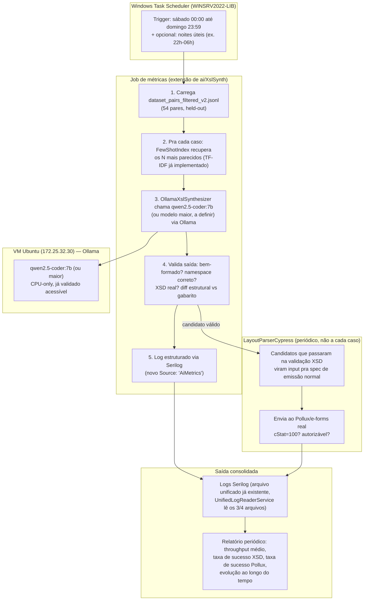

# Plano estratégico — Job de métricas de IA (geração de mapeadores) no servidor de produção

> Objetivo: transformar o spike pontual de RAG (1 medição, 1 caso) num **job recorrente rodando
> no servidor de produção** (ocioso fora do horário comercial/fins de semana), gerando uma série
> real de métricas ao longo do tempo — throughput, qualidade de geração, e validação final via
> Cypress/Pollux — para servir de prova concreta na apresentação ao coordenador/diretoria.
>
> Reaproveita infraestrutura já existente: `ai/XslSynth` (projeto CLI que já tem
> `FewShotIndex`/`OllamaXslSynthesizer`/`OllamaClient` — não vamos duplicar isso), o Serilog já
> configurado na API, e o `LayoutParserCypress` já com a primeira spec de emissão normal.

---

## 1. Por que isso é diferente do spike que já rodamos

O spike (2026-07-29) deu **1 medição**: 1.3 tok/s, 1 caso (CT-e `consStatServCTe`), 1 resultado de
qualidade (75% overlap de tags). Estatisticamente é uma anedota, não uma métrica. O que muda agora:

- **Tempo deixa de ser problema.** O notebook de trabalho não pode ficar ocupado por dias; o
  servidor de produção, fora do horário comercial e nos fins de semana, pode.
- **Volume deixa de ser problema.** Em vez de 1 caso, rodar contra os **54 pares do dataset
  filtrado** (`dataset_pairs_filtered_v2.jsonl`), held-out, repetidamente ao longo de semanas.
- **A métrica final não é só "tokens/s"** — é o **critério de negócio real**: o XML gerado a partir
  da regra que a IA produziu passa no oráculo Pollux (via `LayoutParserCypress`)? Isso fecha o loop
  gerar→validar(XSD)→corrigir→**validar de novo via Cypress real**.

---

## 2. Diagrama de arquitetura



---

## 3. Escolha de modelo

**Recomendação: começar com `qwen2.5-coder:7b`** (mesmo já usado no spike) como baseline —
já validado, já temos 1 medição de referência pra comparar. Depois, **como esforço secundário sem
pressão de prazo** (aproveitando que o servidor fica ocioso por dias), testar uma variante maior
(`qwen2.5-coder:14b` ou `32b`, se a RAM do servidor comportar) só pra ter **dado comparativo real**
de custo-benefício qualidade vs throughput — isso também vira métrica pra apresentação ("testamos
o pequeno e o grande, eis a diferença real").

**Não decidir isso a priori sem medir** — o próprio job já vai gerar esse dado.

---

## 4. Esquema de métricas via Serilog

Novo `Source` estruturado (reaproveitando o padrão já existente de `LogContext.PushProperty`,
mesmo mecanismo usado pro logging unificado Frontend/Backend desta sessão):

```csharp
using (LogContext.PushProperty("Source", "AiMetrics"))
{
    _logger.LogInformation(
        "Geracao concluida. Layout={Layout} Modelo={Model} TokensPorSegundo={TokensPerSecond} " +
        "TamanhoPromptChars={PromptChars} DuracaoSegundos={DurationSeconds} " +
        "SimilaridadeFewShot={FewShotSimilarity} TagOverlapRatio={TagOverlapRatio} " +
        "TextSimilarityRatio={TextSimilarityRatio} XsdValido={XsdValid} " +
        "CypressValidado={CypressValidated} CStatPollux={CStatPollux}",
        layout, model, tokensPerSecond, promptChars, durationSeconds,
        fewShotSimilarity, tagOverlapRatio, textSimilarityRatio, xsdValid,
        cypressValidated, cStatPollux);
}
```

Isso cai automaticamente nos arquivos de log já existentes e já lidos pelo
`UnifiedLogReaderService` (implementado nesta sessão) — **sem precisar de dashboard novo** pra
começar: um filtro por `Source=AiMetrics` no viewer já existente já mostra a série histórica.
Se precisar de visualização melhor pra apresentação, um relatório agregado (script simples que lê
o log e sumariza) é suficiente — não precisa de Grafana/Kibana pra este escopo.

---

## 5. Integração com o Cypress — só nos candidatos que já passaram XSD

**Não** chamar o Cypress a cada geração (caro, precisa de rede real até o Pollux). Fluxo:

1. Job de geração roda livremente contra o dataset held-out, validando XSD/diff estrutural
   localmente (rápido, sem rede externa).
2. Só os candidatos que **passam na validação XSD local** viram candidatos a rodar contra o Pollux
   — isso é filtro de custo: não desperdiça round-trip de rede em algo que já sabemos que vai falhar.
3. Rodagem contra o Pollux acontece em lote, periodicamente (ex. 1x por semana, não a cada geração),
   usando a spec de emissão normal já existente no `LayoutParserCypress` como o "juiz final".

---

## 6. Manual de execução (executado por @lp-devops em 2026-07-30) — ARQUITETURA FINAL

> **Simplificação em relação ao desenho original desta seção:** o job NÃO roda no Windows Server
> via Task Scheduler com hop de rede até a VM. A VM Ubuntu (`172.25.32.31`, `UBU220405RUN`) roda
> no **mesmo hardware físico** do `WINSRV2022-LIB` (sem isolamento real de CPU/RAM, só overhead de
> virtualização) — não há ganho nenhum em cruzar essa fronteira. O job inteiro (dotnet + Ollama +
> agendamento) roda **direto na VM Linux, via `cron`**. Já está em produção real, não é mais plano.

### Estado provisionado na VM (172.25.32.31)

- **.NET SDK 10.0.302** em `~/dotnet` (user-space, sem sudo disponível na VM).
- **Ollama `qwen2.5-coder:7b`** (4.7GB) — primeira tentativa de pull deixou um manifesto
  corrompido (`ollama list`/`api/tags` vazios, `api/generate` com erro de parse JSON); corrigido
  com `ollama rm qwen2.5-coder:7b && ollama pull qwen2.5-coder:7b` (autorizado explicitamente pelo
  usuário, já que é ação potencialmente destrutiva em VM tratada como produção).
- **App publicado** em `~/layoutparser-ai-metrics/` (`dotnet publish -c Release -r linux-x64
  --self-contained false`) + dataset `dataset_pairs_filtered_v2.jsonl` (54 pares) copiado junto.
- **Scripts** em `~/layoutparser-ai-metrics/`: `run-metrics-batch.sh` (roda o dataset **completo**,
  sem `--limit`), `enable-metrics-job.sh`, `disable-metrics-job.sh` (idempotentes, testados em
  ciclo disable→enable→enable sem duplicar entrada no crontab).

### Agendamento (cron, já ativo)

```bash
# Entrada ativa no crontab do usuário elson na VM (todo sábado 00:00):
0 0 * * 6 /home/elson/layoutparser-ai-metrics/run-metrics-batch.sh # layoutparser-ai-metrics-batch

# Desligar temporariamente (ex. servidor precisa da CPU pra outra coisa):
ssh -i "$env:USERPROFILE\.ssh\layoutparser_automation" elson@172.25.32.31 \
  "~/layoutparser-ai-metrics/disable-metrics-job.sh"

# Religar:
ssh -i "$env:USERPROFILE\.ssh\layoutparser_automation" elson@172.25.32.31 \
  "~/layoutparser-ai-metrics/enable-metrics-job.sh"

# Rodar manualmente fora do horário agendado (teste ad-hoc, dia sem uso do servidor):
ssh -i "$env:USERPROFILE\.ssh\layoutparser_automation" elson@172.25.32.31 \
  "~/layoutparser-ai-metrics/run-metrics-batch.sh"
```

### Teste real de validação (2026-07-30, `--limit 2`, 2/2 sucesso)

| Caso | Tok/s | Duração | TagOverlap | TextSimilarity |
|---|---|---|---|---|
| `CTe200_CancCTe_NeogridToSefaz` | 3.685 | 277.8s | 1.0 | 0.8899 |
| `CTe200_consSitCTe_NeogridToSefaz` | 3.749 | 197.5s | 0.7778 | 0.9011 |

Throughput real na VM (~3.7 tok/s) é quase 3× o medido no notebook durante o spike (~1.3 tok/s) —
projeção para o dataset completo (54 pares): **~3-4h**, cabe folgado na janela de fim de semana.

### Verificação de progresso

```bash
# Log estruturado, filtrar por Source=AiMetrics
ssh -i "$env:USERPROFILE\.ssh\layoutparser_automation" elson@172.25.32.31 \
  "grep 'Src:AiMetrics' ~/layoutparser-ai-metrics/Logs/layoutparserapi.log"
```

---

## 7.5 Orquestração Job 1 → Job 2 (proposta, @lp-devops, 2026-07-30) — BLOQUEADA

> Pedido: encadear **Job 1 (metrics-batch)** → **Job 2 (Cypress batch contra Pollux)** no mesmo
> cron/janela de fim de semana, sem a API orquestrar nada (ela só expõe os endpoints do Gap 3,
> passivamente). Investigação feita; desenho abaixo. **Não implementado ainda — ver bloqueios.**

### Decisão de arquitetura: reaproveitar o cron da VM, não GitHub Actions

O Job 1 já roda via `cron` **direto na VM Ubuntu `172.25.32.31`** (seção 6, já em produção) —
não via Task Scheduler nem GitHub Actions. Não há motivo para o Job 2 usar outro orquestrador: o
runner `dev-local` do GitHub Actions é o **Windows Server** (`WINSRV2022-LIB`, ver `ci-dev.yml`),
que só existe para build/deploy da API — usá-lo aqui reintroduziria o hop de rede entre VM e
Windows que a seção 6 já descartou por não ter ganho nenhum (mesmo hardware físico). O orquestrador
continua sendo **o mesmo `cron` de usuário na VM**, com um único script "wrapper" substituindo a
entrada atual — mantém a API 100% passiva, como exigido.

### Desenho proposto: um único ponto de entrada sequencial

```bash
# run-metrics-then-cypress.sh (proposto — NÃO criado/deployado ainda)
#!/usr/bin/env bash
set -euo pipefail

# Job 1 — síncrono. Se falhar (dataset corrompido, Ollama fora do ar), aborta
# ANTES do Job 2 (fail-fast: não faz sentido validar contra Pollux sem geração nova).
~/layoutparser-ai-metrics/run-metrics-batch.sh

# Job 2 — só roda se o Job 1 terminou com sucesso (set -e já garante isso acima).
~/layoutparser-cypress/run-cypress-batch.sh   # a criar por @lp-qa (Cass)
```

A entrada única no crontab (sábado 00:00) passaria a apontar para este wrapper em vez de
`run-metrics-batch.sh` diretamente — sequenciamento por bloqueio simples (o Job 2 só começa
quando o processo do Job 1 termina), sem precisar de lock file/polling.

### Bloqueios (por isso NÃO implementado agora)

1. **Job 2 ("Cypress batch") não existe ainda.** `LayoutParserCypress` hoje
   (`C:\Users\elson.lopes\source\repos\LayoutParserCypress`, commit `24b085c`) tem **1 spec fixa**
   (`cypress/e2e/nfe-emissao-normal.cy.js`) contra **1 fixture fixa** (`nfe-emissao-normal.gabarito.xml`
   / `.mq_series.txt`) — não um mecanismo que itera sobre N candidatos gerados pelo Job 1. Isso é
   trabalho de `@lp-qa`/Cass, já mapeado na seção 7, item 3 (spec parametrizada por lista de XMLs).
   Sem isso, não há `run-cypress-batch.sh` pra chamar.
2. **Stack Cypress não está provisionada na VM.** O provisionamento documentado na seção 6 cobre
   `.NET SDK` + `Ollama` — nada de Node/Cypress/Chrome-Electron/`xvfb`/`libgtk`/`libnss3`. Precisa
   verificar se a VM (`UBU220405RUN`, mesmo host físico do `WINSRV2022-LIB`) tem essas dependências
   de sistema antes de qualquer `npm install`.
3. **Preciso confirmar se `run-metrics-batch.sh` é síncrono de fato.** O wrapper acima assume que
   o script bloqueia até o dataset completo terminar (consistente com a estimativa de "~3-4h" da
   seção 6) — não confirmei o conteúdo do script (não versionado neste repo, só existe na VM).
   Se ele se auto-background (`nohup ... &`), o wrapper precisa de outro mecanismo (lock file/poll)
   em vez de sequenciamento por bloqueio simples.
4. **Sem acesso de execução à VM nesta sessão.** O deploy anterior (seção 6) foi feito via SSH
   com a chave `layoutparser_automation` — esta sessão não tem esse acesso; qualquer aplicação do
   wrapper/crontab exige rodar os comandos manualmente (ou em sessão com a chave disponível),
   e é ação em produção — precisa confirmação explícita antes de tocar no crontab ativo.
5. **`LayoutParserCypress` não tem remoto/push ainda** (ver
   `.claude/agent-memory/lp-devops/layoutparser-cypress-bootstrap.md`) — mesmo depois do Job 2
   existir, o deploy na VM seria via `git clone`/`scp` local, não `git pull` de um remoto público.

### Próximo passo real

Dispatch a `@lp-qa` (Cass, no repo `LayoutParserCypress`) para o item 3 da seção 7 primeiro
(spec batch parametrizada). Só depois disso faz sentido eu (devops) provisionar Node/Cypress na
VM e aplicar o wrapper acima ao crontab — nesta ordem, não em paralelo.

### ⚠️ Revisão de arquitetura (@lp-architect, 2026-07-30) — 3 bloqueios NOVOS

Especificação completa do Job 2 (contratos de entrada/saída, provisionamento, PASS/FAIL) foi
consolidada em **[`handoff-job2-cypress-batch.md`](handoff-job2-cypress-batch.md)**. Ela refina esta
seção e acrescenta bloqueios que **invalidam parte do desenho acima**:

6. **O Job 1 não persiste candidato nenhum.** `MetricsBatchRunner` gera o XSLT, valida em memória e
   **descarta** — não há run dir, manifesto nem arquivo de saída. Não existe "N candidatos gerados
   pelo Job 1" em disco para o Job 2 consumir. → `@lp-parser-llm` (Lia).
7. **O artefato do Job 1 é um XSLT; o Pollux consome um XML de NF-e.** Falta o elo
   `TXT de instância → ROOT → aplicar XSLT → XML`. Só **4 dos 54** pares são elegíveis ao Pollux
   (`NFe…EnvioNFe…`); os demais são retornos SEFAZ→ERP, consultas, CT-e/MDF-e. E o único TXT de
   instância disponível **não casa** com os TCLs do dataset. O Job 2 nasce com N=1–4, não 54.
8. **O painel do Gap 3 está desconectado do Job 1** (bug pré-existente, não introduzido aqui): a API
   lê `C:\inetpub\wwwroot\layoutparser\api\logs\` (Windows) e o Job 1 escreve
   `~/layoutparser-ai-metrics/Logs/` (VM Linux) — arquivos distintos, em máquinas distintas. As linhas
   `Geracao concluida.` nunca chegam ao leitor, então `GET /api/ai-metrics/generations` retorna vazio e
   o merge do `POST /cypress-result` não casa com nada. Solução recomendada: endpoint de ingestão
   de gerações na API (simétrico ao `cypress-result`). → `@lp-backend-dev` (Dex).

**Sobre o bloqueio 3 desta seção (`run-metrics-batch.sh` é síncrono?):** continua **em aberto** —
confirmado que o script **não existe neste repositório**, só na VM (a string aparece unicamente neste
documento). Comandos de evidência a rodar na VM em §7 do handoff. Risco correlato: os scripts de
produção da VM não são versionados — a VM é a única cópia.

## 7. O que falta implementar (próximo passo, dispatch)

1. **`@lp-parser-llm` (Lia):** estender `ai/XslSynth` com um modo `--mode=metrics-batch` que roda
   o loop da seção 2 (recuperação → geração → validação → log Serilog) contra o dataset held-out,
   parametrizável por modelo. Reaproveitar `FewShotIndex`/`OllamaXslSynthesizer` já existentes.
2. **`@lp-devops` (Gage):** provisionar o modelo no servidor, publicar o CLI, configurar o
   Task Scheduler conforme runbook acima.
3. **`@lp-qa`/Cass (Cypress):** expor um modo "batch" na spec de emissão normal que aceita uma
   lista de XMLs candidatos (em vez de só 1 fixture fixo) para a rodagem periódica semanal contra
   o Pollux.
4. Após 1-2 semanas de coleta: relatório consolidado (posso desenhar isso quando tivermos dado
   real) para a apresentação.

Quer que eu já dispare o item 1 (Lia) agora, ou prefere revisar este plano primeiro?
