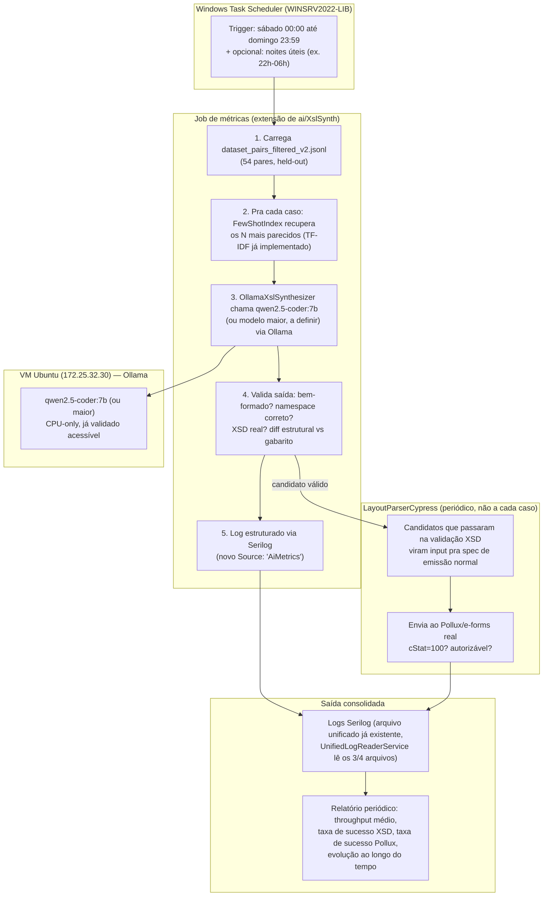

# Plano estratégico — Job de métricas de IA (geração de mapeadores) no servidor de produção

> Objetivo: transformar o spike pontual de RAG (1 medição, 1 caso) num **job recorrente rodando
> no servidor de produção** (ocioso fora do horário comercial/fins de semana), gerando uma série
> real de métricas ao longo do tempo — throughput, qualidade de geração, e validação final via
> Cypress/Pollux — para servir de prova concreta na apresentação ao coordenador/diretoria.
>
> Reaproveita infraestrutura já existente: `ai/XslSynth` (projeto CLI que já tem
> `FewShotIndex`/`OllamaXslSynthesizer`/`OllamaClient` — não vamos duplicar isso), o Serilog já
> configurado na API, e o `LayoutParserCypress` já com a primeira spec de emissão normal.

---

## 1. Por que isso é diferente do spike que já rodamos

O spike (2026-07-29) deu **1 medição**: 1.3 tok/s, 1 caso (CT-e `consStatServCTe`), 1 resultado de
qualidade (75% overlap de tags). Estatisticamente é uma anedota, não uma métrica. O que muda agora:

- **Tempo deixa de ser problema.** O notebook de trabalho não pode ficar ocupado por dias; o
  servidor de produção, fora do horário comercial e nos fins de semana, pode.
- **Volume deixa de ser problema.** Em vez de 1 caso, rodar contra os **54 pares do dataset
  filtrado** (`dataset_pairs_filtered_v2.jsonl`), held-out, repetidamente ao longo de semanas.
- **A métrica final não é só "tokens/s"** — é o **critério de negócio real**: o XML gerado a partir
  da regra que a IA produziu passa no oráculo Pollux (via `LayoutParserCypress`)? Isso fecha o loop
  gerar→validar(XSD)→corrigir→**validar de novo via Cypress real**.

---

## 2. Diagrama de arquitetura



---

## 3. Escolha de modelo

**Recomendação: começar com `qwen2.5-coder:7b`** (mesmo já usado no spike) como baseline —
já validado, já temos 1 medição de referência pra comparar. Depois, **como esforço secundário sem
pressão de prazo** (aproveitando que o servidor fica ocioso por dias), testar uma variante maior
(`qwen2.5-coder:14b` ou `32b`, se a RAM do servidor comportar) só pra ter **dado comparativo real**
de custo-benefício qualidade vs throughput — isso também vira métrica pra apresentação ("testamos
o pequeno e o grande, eis a diferença real").

**Não decidir isso a priori sem medir** — o próprio job já vai gerar esse dado.

---

## 4. Esquema de métricas via Serilog

Novo `Source` estruturado (reaproveitando o padrão já existente de `LogContext.PushProperty`,
mesmo mecanismo usado pro logging unificado Frontend/Backend desta sessão):

```csharp
using (LogContext.PushProperty("Source", "AiMetrics"))
{
    _logger.LogInformation(
        "Geracao concluida. Layout={Layout} Modelo={Model} TokensPorSegundo={TokensPerSecond} " +
        "TamanhoPromptChars={PromptChars} DuracaoSegundos={DurationSeconds} " +
        "SimilaridadeFewShot={FewShotSimilarity} TagOverlapRatio={TagOverlapRatio} " +
        "TextSimilarityRatio={TextSimilarityRatio} XsdValido={XsdValid} " +
        "CypressValidado={CypressValidated} CStatPollux={CStatPollux}",
        layout, model, tokensPerSecond, promptChars, durationSeconds,
        fewShotSimilarity, tagOverlapRatio, textSimilarityRatio, xsdValid,
        cypressValidated, cStatPollux);
}
```

Isso cai automaticamente nos arquivos de log já existentes e já lidos pelo
`UnifiedLogReaderService` (implementado nesta sessão) — **sem precisar de dashboard novo** pra
começar: um filtro por `Source=AiMetrics` no viewer já existente já mostra a série histórica.
Se precisar de visualização melhor pra apresentação, um relatório agregado (script simples que lê
o log e sumariza) é suficiente — não precisa de Grafana/Kibana pra este escopo.

---

## 5. Integração com o Cypress — só nos candidatos que já passaram XSD

**Não** chamar o Cypress a cada geração (caro, precisa de rede real até o Pollux). Fluxo:

1. Job de geração roda livremente contra o dataset held-out, validando XSD/diff estrutural
   localmente (rápido, sem rede externa).
2. Só os candidatos que **passam na validação XSD local** viram candidatos a rodar contra o Pollux
   — isso é filtro de custo: não desperdiça round-trip de rede em algo que já sabemos que vai falhar.
3. Rodagem contra o Pollux acontece em lote, periodicamente (ex. 1x por semana, não a cada geração),
   usando a spec de emissão normal já existente no `LayoutParserCypress` como o "juiz final".

---

## 6. Manual de execução (runbook para @lp-devops)

### Pré-requisitos no servidor (`WINSRV2022-LIB`, Windows Server 2022)

1. Confirmar que a VM Ubuntu (`172.25.32.30:11434`) está acessível a partir do Windows Server —
   já era pré-requisito da topologia de produção (ver `deploy-production-topology`).
2. Puxar o modelo escolhido no Ollama da VM: `ollama pull qwen2.5-coder:7b` (e opcionalmente
   `14b`/`32b` pro teste comparativo).
3. Publicar/copiar o `ai/XslSynth` (com as extensões de métricas, ver seção 7) pro servidor —
   é um projeto CLI, não precisa estar dentro do deploy da API.

### Agendamento (Windows Task Scheduler)

```powershell
# Criar tarefa agendada: só roda fins de semana (sábado 00:00 até domingo 23:59)
$action = New-ScheduledTaskAction -Execute "dotnet" `
  -Argument "C:\ai-metrics\XslSynth.dll --mode=metrics-batch --dataset=dataset_pairs_filtered_v2.jsonl"
$trigger = New-ScheduledTaskTrigger -Weekly -DaysOfWeek Saturday -At 00:00
Register-ScheduledTask -TaskName "LayoutParser-AiMetrics" -Action $action -Trigger $trigger `
  -Description "Job de metricas de geracao de mapeadores via IA (roda so fins de semana)"

# Parar manualmente a qualquer momento:
Stop-ScheduledTask -TaskName "LayoutParser-AiMetrics"

# Rodar manualmente fora do horario agendado (ex. dia sem uso do servidor):
Start-ScheduledTask -TaskName "LayoutParser-AiMetrics"
```

Isso dá exatamente o controle que você descreveu: liga/desliga quando quiser, roda sozinho nos
fins de semana por padrão, sem depender de alguém lembrar de iniciar manualmente.

### Verificação de progresso

```powershell
# Ver se está rodando agora
Get-ScheduledTask -TaskName "LayoutParser-AiMetrics" | Get-ScheduledTaskInfo

# Ver métricas acumuladas (filtrar log unificado por Source=AiMetrics)
# via endpoint GET /api/logs já implementado nesta sessão, ou leitura direta do arquivo
```

---

## 7. O que falta implementar (próximo passo, dispatch)

1. **`@lp-parser-llm` (Lia):** estender `ai/XslSynth` com um modo `--mode=metrics-batch` que roda
   o loop da seção 2 (recuperação → geração → validação → log Serilog) contra o dataset held-out,
   parametrizável por modelo. Reaproveitar `FewShotIndex`/`OllamaXslSynthesizer` já existentes.
2. **`@lp-devops` (Gage):** provisionar o modelo no servidor, publicar o CLI, configurar o
   Task Scheduler conforme runbook acima.
3. **`@lp-qa`/Cass (Cypress):** expor um modo "batch" na spec de emissão normal que aceita uma
   lista de XMLs candidatos (em vez de só 1 fixture fixo) para a rodagem periódica semanal contra
   o Pollux.
4. Após 1-2 semanas de coleta: relatório consolidado (posso desenhar isso quando tivermos dado
   real) para a apresentação.

Quer que eu já dispare o item 1 (Lia) agora, ou prefere revisar este plano primeiro?
