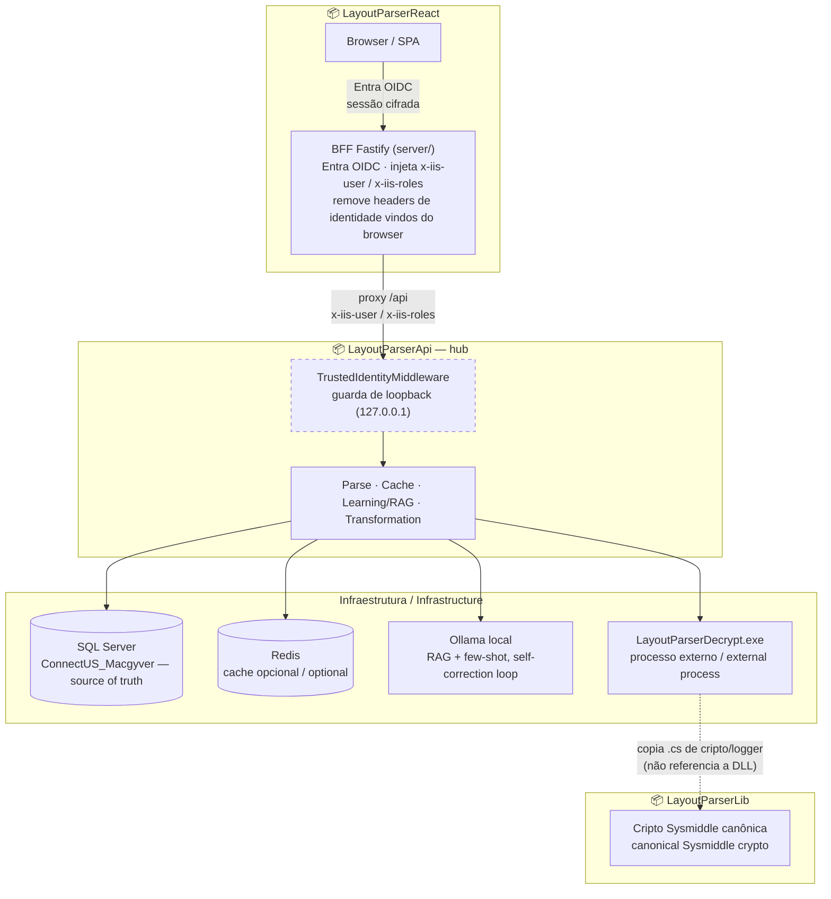

# LayoutParser

> **PT-BR** · Rascunho do README de perfil da organização GitHub `LayoutParser`. Publica-se como
> `.github/README.md` (ou `profile/README.md`) num repo especial `.github` da org — feito aqui como
> conteúdo pronto para o `@lp-devops` decidir onde/quando publicar.
>
> **EN** · Draft README for the `LayoutParser` GitHub organization profile page. Meant to live as
> `.github/README.md` (or `profile/README.md`) in a special `.github` org repo — written here as
> ready content, publishing location is `@lp-devops`'s call.

---

## 📑 Índice / Table of Contents

1. [O que é o LayoutParser / What is LayoutParser](#1-o-que-é-o-layoutparser--what-is-layoutparser)
2. [Arquitetura em 3 camadas / 3-layer architecture](#2-arquitetura-em-3-camadas--3-layer-architecture)
3. [Os 4 repositórios / The 4 repositories](#3-os-4-repositórios--the-4-repositories)
4. [Visão de IA / AI vision](#4-visão-de-ia--ai-vision)
5. [Como contribuir / How to contribute](#5-como-contribuir--how-to-contribute)
6. [Segurança / Security](#6-segurança--security)
7. [Novidades / What's new](#7-novidades--whats-new)

---

## 1. O que é o LayoutParser / What is LayoutParser

**🇧🇷** O LayoutParser é uma plataforma para **ler, validar e transformar documentos de integração**
(notas fiscais eletrônicas e mensagens corporativas). O usuário anexa um **layout XML** — a "planta"
desenhada no low-code **Sysmiddle**, descrevendo linhas, campos, posições e tamanhos — e um
**documento posicional** (`.txt`, MQSeries, IDOC). O sistema casa os dois, devolve a estrutura
parseada, e uma camada de IA/ML aprende, em background, a gerar sozinha as transformações
(**XSLT/TCL**) que hoje dependem do desenho manual no low-code.

**🇺🇸** LayoutParser is a platform for **reading, validating and transforming integration documents**
(electronic fiscal notes and corporate messages). The user uploads an **XML layout** — the blueprint
authored in the **Sysmiddle** low-code tool, describing rows, fields, positions and sizes — and a
**positional document** (`.txt`, MQSeries, IDOC). The system matches them, returns the parsed
structure, and an AI/ML layer learns, in the background, to generate the transformations
(**XSLT/TCL**) that today depend on manual low-code design.

> **Contexto acadêmico / Academic note:** este ecossistema é a base de um projeto de faculdade
> (TCC). A documentação é mantida bilíngue propositadamente. / This ecosystem is the base of a
> college capstone project; documentation is intentionally bilingual.

---

## 2. Arquitetura em 3 camadas / 3-layer architecture

**🇧🇷** O acesso de produção passa por três camadas, cada uma com uma responsabilidade de confiança
distinta:

**🇺🇸** Production access flows through three layers, each with a distinct trust responsibility:

```
Browser  ──(Entra OIDC, sessão cifrada)──►  BFF Fastify  ──(proxy /api + headers de identidade)──►  API .NET
        session encrypted                    server/ (LayoutParserReact)      trusts x-iis-user/roles
```

| Fronteira / Boundary | Mecanismo / Mechanism | Responde por / Answers |
|---|---|---|
| Browser ↔ BFF | **Microsoft Entra ID (OIDC)** — login, sessão cifrada, roles vindas de claims | *quem é o usuário* / *who the user is* |
| BFF ↔ API .NET | **Rede** (a API só aceita o BFF) — sem chave compartilhada nesse salto | *esta chamada vem do BFF confiável* / *this call comes from the trusted BFF* |
| Dentro da API | Consome `x-iis-user`/`x-iis-roles` injetados pelo BFF para identidade e auditoria | *quem fez o quê* / *who did what* |

**🇧🇷** O BFF Fastify (`LayoutParserReact/server/`) remove qualquer header de identidade vindo do
próprio browser antes de injetar os headers confiáveis a partir da sessão Entra — anti-*spoofing* na
camada dele. Na API, o `TrustedIdentityMiddleware` só confia nesses headers se a requisição vier de
`127.0.0.1` (guarda de loopback), fechando a forja de identidade mesmo enquanto a API ainda escuta em
todas as interfaces de rede.

**🇺🇸** The Fastify BFF (`LayoutParserReact/server/`) strips any identity header coming from the
browser itself before injecting the trusted headers derived from the Entra session — anti-spoofing at
its own layer. On the API side, `TrustedIdentityMiddleware` only trusts those headers if the request
comes from `127.0.0.1` (loopback guard), closing the identity-forging gap even while the API still
listens on every network interface.

> Estado real, não aspiracional — ver [§6](#6-segurança--security).

**🇧🇷** Diagrama de fluxo (renderiza nativamente no GitHub), com os 4 repositórios identificados em
cada camada e as dependências de infraestrutura reais:

**🇺🇸** Flow diagram (renders natively on GitHub), with the 4 repositories identified per layer and
the real infrastructure dependencies:



**🇧🇷** Nota de leitura: a borda tracejada em `TrustedIdentityMiddleware` marca que a guarda de
loopback já está ativa e testada, mas a trava de rede que a sustenta (API deixar de escutar em
`0.0.0.0`) ainda está **pendente** — ver [§6](#6-segurança--security) para o estado real e não
desenhar TLS Browser↔BFF aqui como algo confirmado, pois não foi verificado nesta revisão.

**🇺🇸** Reading note: the dashed border on `TrustedIdentityMiddleware` marks that the loopback guard
is already active and tested, but the network lockdown that backs it (API no longer listening on
`0.0.0.0`) is still **pending** — see [§6](#6-segurança--security) for the real state; TLS
Browser↔BFF is intentionally not drawn here as confirmed, since it wasn't verified in this review.

---

## 3. Os 4 repositórios / The 4 repositories

| Repositório | Papel / Role | Stack |
|-------------|---------------|-------|
| **[LayoutParserApi](https://github.com/LayoutParser/LayoutParserApi)** | **Hub** — orquestra parse, cache, IA/ML, transformação e logging. *Source of truth* do runtime. | ASP.NET Core (.NET 10) |
| **[LayoutParserLib](https://github.com/LayoutParser/LayoutParserLib)** | Biblioteca canônica de **criptografia Sysmiddle** (`CryptographySysMiddle.Decrypt`) e logger em arquivo compartilhados. | .NET Framework 4.8.1 (class library) |
| **[LayoutParserDecrypt](https://github.com/LayoutParser/LayoutParserDecrypt)** | Console `.exe` que descriptografa layouts/mappers da Sysmiddle — invocado pela API como **processo externo**, porque a API (net10) não roda o `RijndaelManaged` legado em processo de forma compatível. | .NET Framework 4.8.1 (console) |
| **[LayoutParserReact](https://github.com/LayoutParser/LayoutParserReact)** | **Front-end** (upload, render da estrutura parseada, edição de layouts) + **BFF Fastify** (`server/`) que faz login via Entra OIDC e faz proxy autenticado para a API. | Vite + React + TypeScript · Node/Fastify |

```
LayoutParserReact (SPA)
        │  Entra OIDC (browser ↔ BFF)
        ▼
LayoutParserReact/server (BFF Fastify)
        │  proxy /api + x-iis-user/x-iis-roles (rede confiável)
        ▼
LayoutParserApi (.NET 10) ── Parse ── Cache(Redis) ── Learning/RAG ── Transformation
        │                       │                                        │
        ▼                       ▼                                        ▼
LayoutParserDecrypt.exe   SQL Server                              LLM (Ollama local)
   (descriptografia)   (ConnectUS_Macgyver
        │                — source of truth)
        ▼
LayoutParserLib (cripto canônica — Decrypt copia as fontes; API não a referencia em runtime)
```

**🇧🇷** Nota de paridade: o `LayoutParserDecrypt` **copia** os `.cs` de cripto/logger do `LayoutParserLib`
em vez de referenciar a DLL, para que seu CI compile de forma autocontida. As cópias já divergiram no
passado — sincronizar as duas ao alterar a cripto é responsabilidade cross-repo.

**🇺🇸** Parity note: `LayoutParserDecrypt` **copies** the crypto/logger `.cs` files from
`LayoutParserLib` instead of referencing the DLL, so its CI builds standalone. The copies have
diverged before — keeping them in sync when touching the crypto is a cross-repo responsibility.

---

## 4. Visão de IA / AI vision

**🇧🇷** O objetivo de longo prazo é **eliminar o XML low-code do Sysmiddle**: hoje um analista desenha
o mapeamento no low-code, produzindo um XML intermediário; a meta é o back-end **gerar sozinho o
XSLT** que transforma o documento original no XML final. Cada documento processado gera um triplo
**(TXT, XML low-code, XML final)** — um dataset de tradução supervisionada já rotulado.

**🇺🇸** The long-term goal is to **retire the Sysmiddle low-code XML**: today an analyst designs the
mapping in the low-code tool, producing an intermediate XML; the goal is for the back-end to
**generate the XSLT itself** that transforms the original document into the final XML. Every
processed document yields a triple **(TXT, low-code XML, final XML)** — a pre-labeled supervised
translation dataset.

**🇧🇷** A abordagem escolhida **não é fine-tuning** — é **RAG + few-shot com loop de auto-correção**,
rodando em **Ollama local** (dados ficam on-premise; Gemini/OpenAI foram decomissionados como
provedores de LLM):

**🇺🇸** The chosen approach is **not fine-tuning** — it's **RAG + few-shot with a self-correction
loop**, running on **local Ollama** (data stays on-premise; Gemini/OpenAI were decommissioned as LLM
providers):

```
INDEX (embeddings de pares layout→XSLT) → RETRIEVE (k exemplos similares) →
GENERATE (Ollama gera XSLT candidato) → VALIDATE (XSD + diff contra o XML final) →
CORRECT (realimenta erros no prompt, repete até convergir)
```

**🇧🇷** Motivo de fundo do Ollama-only: dado fiscal sensível não deve sair para a nuvem sem
autorização explícita. Detalhe completo (fluxo, serviços, roadmap) no
[README do `LayoutParserApi`, §5](https://github.com/LayoutParser/LayoutParserApi#5-a-visão-de-ia--the-ai-vision).

**🇺🇸** Underlying reason for Ollama-only: sensitive fiscal data must not leave the premises without
explicit authorization. Full detail (flow, services, roadmap) in the
[`LayoutParserApi` README, §5](https://github.com/LayoutParser/LayoutParserApi#5-a-visão-de-ia--the-ai-vision).

---

## 5. Como contribuir / How to contribute

**🇧🇷**

- **Conventional Commits:** `feat:`, `fix:`, `docs:`, `refactor:`, `test:`, `chore:`.
- Fluxo de branch: `feature/* → develop → master`. `master` e `develop` têm **branch protection**
  (PR obrigatório, 1 aprovação, sem force-push, sem exclusão).
- Um workflow (`merge-gate.yml`, job `verify-source`) valida que PRs contra `master` vêm de
  `develop` — mas esse check **ainda não está** anexado como *required status check* na proteção da
  branch, então hoje ele roda e falha visualmente sem bloquear o merge por si só (pendência).
- **Push direto e merge de PR são exclusivos do agente/operador `@lp-devops`** nos repos que usam o
  harness Claude Code; os demais fazem `git add`/`commit` local e abrem PR.

**🇺🇸**

- **Conventional Commits:** `feat:`, `fix:`, `docs:`, `refactor:`, `test:`, `chore:`.
- Branch flow: `feature/* → develop → master`. Both `master` and `develop` have **branch
  protection** (required PR, 1 approval, no force-push, no deletion).
- A workflow (`merge-gate.yml`, `verify-source` job) validates that PRs against `master` come from
  `develop` — but that check is **not yet** attached as a required status check on branch protection,
  so today it runs and visually fails without blocking the merge by itself (open gap).
- **Direct pushes and PR merges are exclusive to the `@lp-devops` agent/operator** in repos using the
  Claude Code harness; everyone else does local `git add`/`commit` and opens a PR.

---

## 6. Segurança / Security

**🇧🇷** Estado real, checado nas PRs mais recentes — não aspiracional:

- ✅ **Identidade do BFF construída e verificada:** a API já consome `x-iis-user`/`x-iis-roles`
  injetados pelo BFF (`TrustedIdentityMiddleware`), com **guarda de loopback ativa e testada**
  (headers de identidade só são confiados se a requisição vier de `127.0.0.1`).
- ✅ O antigo mecanismo de chave compartilhada (`ApiKeyGateFilter`) foi **removido** — a defesa
  BFF↔API é por rede + identidade, não por segredo.
- 🔴 **Trava de rede pendente:** a API ainda pode estar escutando em todas as interfaces
  (`0.0.0.0`), não só em `127.0.0.1`. A guarda de loopback do middleware é a 1ª camada de defesa; a
  trava de bind/firewall é a 2ª, e está **gated** até confirmar que o painel de produção passa pelo
  BFF (e não mais direto na porta da API).
- 🔴 **Nenhum endpoint tem `[Authorize]` ainda** — todos continuam acessíveis sem checagem de papel.
  O mecanismo (`ICurrentUser.IsInRole`) já existe; quais endpoints viram privilegiados é decisão de
  produto documentada, mas não aplicada em código.
- 🔴 **Segredos comprometidos aguardando rotação/revogação:** a senha do SQL Server e a (já
  decomissionada) API key do Gemini estiveram em texto plano no histórico do `LayoutParserApi`.
  Remoção do código/config está feita; **rotação da senha SQL** e **revogação da key do Gemini**
  seguem como ação do operador. A chave/IV de criptografia do `LayoutParserLib`/`LayoutParserDecrypt`
  também estão **hardcoded no código-fonte** — limitação conhecida, documentada nos READMEs desses
  repos.

**🇺🇸** Real state, checked against the most recent PRs — not aspirational:

- ✅ **BFF identity consumption built and verified:** the API already consumes
  `x-iis-user`/`x-iis-roles` injected by the BFF (`TrustedIdentityMiddleware`), with an **active and
  tested loopback guard** (identity headers are only trusted if the request comes from
  `127.0.0.1`).
- ✅ The old shared-API-key mechanism (`ApiKeyGateFilter`) was **removed** — the BFF↔API boundary is
  defended by network + identity, not a shared secret.
- 🔴 **Network lockdown pending:** the API may still be listening on every interface (`0.0.0.0`),
  not just `127.0.0.1`. The middleware's loopback guard is the 1st line of defense; the bind/firewall
  lockdown is the 2nd, and is **gated** until it's confirmed the production panel goes through the
  BFF (not directly to the API's port).
- 🔴 **No endpoint has `[Authorize]` yet** — all remain accessible without role checks. The
  mechanism (`ICurrentUser.IsInRole`) already exists; which endpoints become privileged is a
  documented product decision, not yet applied in code.
- 🔴 **Compromised secrets awaiting rotation/revocation:** the SQL Server password and the (now
  decommissioned) Gemini API key were exposed in plaintext in `LayoutParserApi`'s git history.
  Code/config removal is done; **SQL password rotation** and **Gemini key revocation** remain operator
  actions. The `LayoutParserLib`/`LayoutParserDecrypt` encryption key/IV are also **hardcoded in
  source** — a known limitation, documented in those repos' READMEs.

> Detalhe completo por repositório: `.claude/rules/security.md` e
> `docs/architecture/rollout-p2-autenticacao.md` no `LayoutParserApi`; seção de segurança nos READMEs
> do `LayoutParserLib` e `LayoutParserDecrypt`.

---

## 7. Novidades / What's new

**🇧🇷** Changelog curto do que foi concluído recentemente no ecossistema — não é histórico de commit
completo (isso está no `git log` de cada repo), é o resumo do que mudou no comportamento/estado real.

**🇺🇸** Short changelog of what was recently completed across the ecosystem — not a full commit
history (that lives in each repo's `git log`), just a summary of what changed in real
behavior/state.

<!-- adicionar novo dia no topo / add new day at the top -->

### 2026-08-13

**🇧🇷**
- ✅ Consumo de identidade do BFF (`TrustedIdentityMiddleware` + guarda de loopback ativa e testada) — `LayoutParserApi` PR [#28](https://github.com/LayoutParser/LayoutParserApi/pull/28)
- ✅ Auditoria e enforcement por papel (`[Authorize(Roles=...)]`) nos endpoints privilegiados (`LogsController`, `DataGenerationController`, `TransformationExecutionController`) — PR [#43](https://github.com/LayoutParser/LayoutParserApi/pull/43)
- ✅ `ApiKeyGateFilter` removido (mecanismo morto) e API trancada em loopback como higiene de segurança
- ✅ HTTPS habilitado no Kestrel com certificado autoassinado — PR [#54](https://github.com/LayoutParser/LayoutParserApi/pull/54)
- ✅ Pathway de geração via IA (Ollama) em `execute-candidates` — Issue #40, PRs [#52](https://github.com/LayoutParser/LayoutParserApi/pull/52)/[#57](https://github.com/LayoutParser/LayoutParserApi/pull/57)
- ✅ Persistência de candidatos do Job 1 (XSLT + prompt + validação) com retenção de 30 dias — PRs [#50](https://github.com/LayoutParser/LayoutParserApi/pull/50)/[#58](https://github.com/LayoutParser/LayoutParserApi/pull/58)
- ✅ Refactor: `ai/XslSynth.Core` extraído como classlib compartilhada, elimina diff ad-hoc do pathway IA — PR [#61](https://github.com/LayoutParser/LayoutParserApi/pull/61)
- ✅ Fix: agregação de ocorrências posicionais de `LineElement` em `ValidateLineOccurrences` — PR [#49](https://github.com/LayoutParser/LayoutParserApi/pull/49)

**🇺🇸**
- ✅ BFF identity consumption (`TrustedIdentityMiddleware` + active, tested loopback guard) — `LayoutParserApi` PR [#28](https://github.com/LayoutParser/LayoutParserApi/pull/28)
- ✅ Audit trail and role enforcement (`[Authorize(Roles=...)]`) on privileged endpoints (`LogsController`, `DataGenerationController`, `TransformationExecutionController`) — PR [#43](https://github.com/LayoutParser/LayoutParserApi/pull/43)
- ✅ Dead `ApiKeyGateFilter` removed and API locked down to loopback as security hygiene
- ✅ HTTPS enabled on Kestrel with a self-signed certificate — PR [#54](https://github.com/LayoutParser/LayoutParserApi/pull/54)
- ✅ AI generation pathway (Ollama) in `execute-candidates` — Issue #40, PRs [#52](https://github.com/LayoutParser/LayoutParserApi/pull/52)/[#57](https://github.com/LayoutParser/LayoutParserApi/pull/57)
- ✅ Job 1 candidate persistence (XSLT + prompt + validation) with 30-day retention — PRs [#50](https://github.com/LayoutParser/LayoutParserApi/pull/50)/[#58](https://github.com/LayoutParser/LayoutParserApi/pull/58)
- ✅ Refactor: `ai/XslSynth.Core` extracted as a shared classlib, removing the ad-hoc diff from the AI pathway — PR [#61](https://github.com/LayoutParser/LayoutParserApi/pull/61)
- ✅ Fix: positional `LineElement` occurrence aggregation in `ValidateLineOccurrences` — PR [#49](https://github.com/LayoutParser/LayoutParserApi/pull/49)

---

<p align="center"><sub>LayoutParser · ecossistema de 4 repositórios · documentação bilíngue mantida para fins acadêmicos e operacionais.</sub></p>
